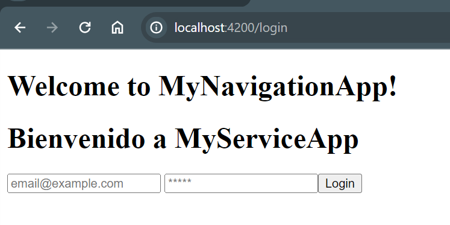
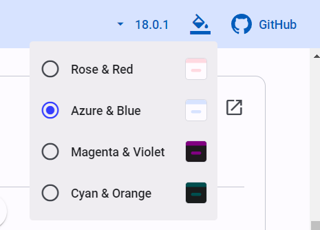
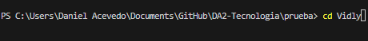
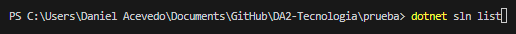
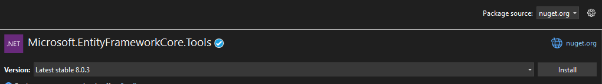
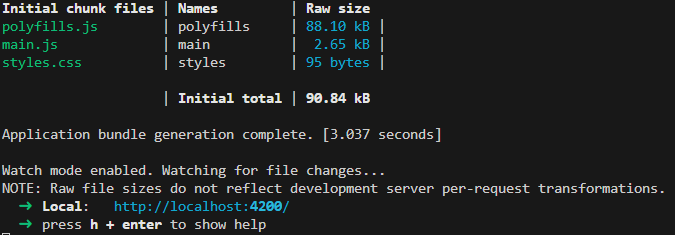
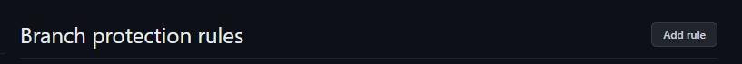
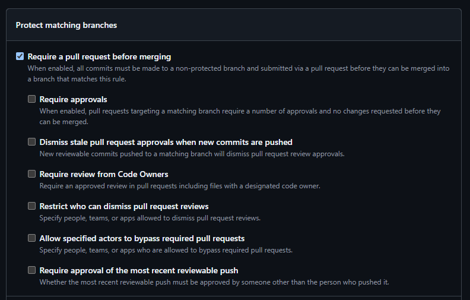
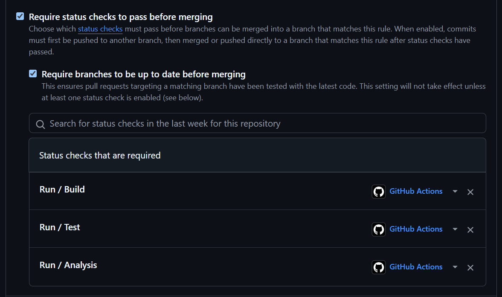
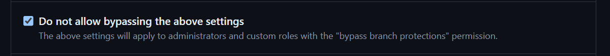

[Volver - Main](https://github.com/IngSoft-DA2/DA2-Tecnologia)

# Configuración del repo

A continuación se pueden encontrar aquellos archivos que son requeridos en la solución junto con una breve descripción de su funcionalidad dentro del repositorio y de la solución.

## Archivos

- **[.gitignore](https://github.com/daniel18acevedo/DA2-Tecnologia/blob/repo-configuration/.gitignore)**: Este archivo es para ignorar aquellos archivos que no se quiere tener un control de version. Esto quiere decir, que ciertos archivos por más que sean modificados, eliminados o agregados, no se vera ningún cambio efectuado en el histórico de cambios de git al momento de crear un commit. Para que este archivo haga efecto, tiene que ser controlado primero por git antes que aquellos archivos que deseamos ignorar. En caso de agregar este archivo posteriormente al repo y los archivos que deseamos ignorar ya estan siendo trackeados por git, estos deberán de ser eliminados, commitear la eliminación de los mismos y luego cuando vuelvan a ser agregados estos ya no se verán en el historico de cambios. La eliminación de los archivos y el commit hacen que git deje de trackear los cambios en esos archivos para que pueda tener efecto el gitignore.

- **[.editorconfig](https://github.com/daniel18acevedo/DA2-Tecnologia/blob/repo-configuration/.editorconfig)**: Configuración de reglas de clean code para C#.

- **[Directory.Build.props](https://github.com/daniel18acevedo/DA2-Tecnologia/blob/repo-configuration/Directory.Build.props)**: Archivo dónde se especifícan aquellos paquetes junto con sus versiones que son usados por todos los proyectos locales de la solución. Es una forma más rápida de controlar sus versiones y que los paquetes locales se actualicen en simultaneo. Es muy util este archivo para tener centralizado aquellas dependencias transversales que impactan a todos los proyectos de la solución.

- **[pull_request_template.md](https://github.com/daniel18acevedo/DA2-Tecnologia/blob/repo-configuration/pull_request_template.md)**: Es una guía sobre la información a incluir en los pull request que se creen. La mísma se debera de modificar en las partes necesarias para agregar información sobre el PR del trabajo realizado.

- **[.github/workflows/build-test.yml](https://github.com/daniel18acevedo/DA2-Tecnologia/blob/repo-configuration/.github/workflows/build-test.yml)**: Es la configuración que permitira que compile la solución y corra las pruebas a la hora de mergear una rama no protegida a una protegida (develop y main), también se ejecutara cuando se cree un PR a una rama protegida o cuando este PR creado se vea modificado al crear nuevos commits en la rama.

- **[.github/workflows/code-analysis.yml](https://github.com/daniel18acevedo/DA2-Tecnologia/blob/repo-configuration/.github/workflows/code-analysis.yml)**: Es la configuración que analiza el código estático para corroborar el cumplimiento de los estandares establecidos y reglas de clean code en el archivo **.editorconfig**.

  - Estos dos ultimos archivos para que tengan efecto, se tienen que encontrar en el directorio `.github/workflows` en la raíz del repositorio.

- **[.gitattributes](https://github.com/daniel18acevedo/DA2-Tecnologia/blob/repo-configuration/.gitattributes)**: Este archivo de configuración permite asignarle atributos a otros archivos y directorios en el proyecto, para poder indicarle a Git como debe tratarlos.

- **[.runsettings](https://github.com/IngSoft-DA2/DA2-Tecnologia/blob/repo-configuration/.runsettings)**: Este archivo de configuración permite configurar algunos elementos al generar la cobertura de código usando `dotnet cli`. Lo que configura particularmente es que se ignoren las `migraciones` generadas y cualquier clase con algun atributo `GeneratedCodeAttribute`. De esta manera estamos dejando por fuera clases autogeneradas de la cobertura.

## Configuración para VSC
- **[.vscode/settings.json](https://github.com/IngSoft-DA2/DA2-Tecnologia/blob/repo-configuration/.vscode/settings.json)**: Este archivo sirve para configurar VSCode para trabajar en proyectos .NET. Configura varios elementos, desde la terminación de los archivos nuevos usando CRLF hasta el tamaño del tab que deberia ser 4 espacios. Debe ser agregado junto con la carpeta.

- **[.NET.code-profile](https://github.com/IngSoft-DA2/DA2-Tecnologia/blob/repo-configuration/.NET.code-profile)**: Es un perfil diseñado para trabajar en proyectos .NET, este debera de ser descargado e importado en VSCode para ser usado en proyectos .NET. El mismo trae configuraciones de extensiones utiles para tratar VSCode lo mas parecido al IDE VS.

# Badges

Las badges son elementos que nos permiten visualizar rapidamente el estado del repositorio. Estos nos van a servir para ver rapidamente si las pruebas estan pasando o fallando y si se esta respetando clean code sin la necesidad de inspeccionar en profundidad el repositorio y/o el código.

```md

```

<p align="center">
  [Badge de build y test para develop]
</p>

```md

```

<p align="center">
  [Badge de build y test para main]
</p>


```md

```

<p align="center">
  [Badge de clean code para develop]
</p>

```md

```

<p align="center">
  [Badge de clean code para main]
</p>

Dichos badges, se tienen que pegar en el `Readme.md` del repositorio y se debe cambiar `https://github.com/IngSoft-DA2/Test` por la url del repositorio.

# Subida de archivos
1. Clonarse el repo
2. Deberíamos de estar situados en la rama main
3. Agregar todos los archivos para la configuración a la carpeta raiz del repositorio
4. Agregar un archivo con extensión `.cs` (por ejemplo `Test.cs`), esto hará que se ejecuten las actions al commitearse
5. Modificar el readme con las insigneas pudiendo diferenciar cuales son de `main` y cuales son de `develop` por ejemplo quedando parecido a lo siguiente
```
## Main
<< insigneas de main >>

## Develop
<< insigneas de develop>>
```
6. Una vez agregado todos los archivos, el `.cs` de prueba y modificado el readme, realizar el commit inicial
7. Deberíamos de ver que las actions están ejecutándose y deberían fallar porque no tenemos código para probar, compilar ni analizar de forma estática
8. Una vez que terminen de ejecutar las actions continuar con: [Configuración de branches](https://github.com/IngSoft-DA2/DA2-Tecnologia/tree/pr-creation)
9. Al finalizar toda la configuración como resultado deberíamos de tener 
  9.1. Un único commit en `main` y `develop` creado a partir de éste
  9.2 Dos actions ejecutadas y en estado failure
  9.3 Las insigneas indicando el estado failure de ambas ramas 
11. Luego de que se termino de configurar y se creo la rama develop, en el primer PR podemos eliminar esta clase `Test.cs` de prueba creada

# Configuración de branches

Se requiere que configuren reglas en las branches principales para evitar conflictos al momento de mergear.

- Ir a Settings (Última opción en la barra de navegación en github en el repositorio)
<p align="center">

</p>

## General

- Ir a `General`
<p align="center">

</p>

- La branch por defecto debera ser una rama con el nombre `develop`. El nombre de la branch indica el ambiente en el cual está el código, la branch `develop` es el ambiente de desarrollo, por eso es que debe ser la `default` branch ya que es a la que se estara mergeando y actualizando constantemente. La branch `main` es para el ambiente de "producción", a ésta rama no se le suele mergear código tan seguidamente cómo a `develop`. Esta rama se vera actualizada únicamente los días de las entregas y solamente puede ser actualizada desde `develop`.

<p align="center">

</p>

- Sección `Feature`. Desmarcar todos los check-box excepto por el último.

<p align="center">

</p>

- Configurar la sección de `Pull Requests` de la siguiente manera
<p align="center">

</p>

## Branches

- Ir a Branches
<p align="center">

</p>

- Crear una nueva regla, seleccionar la opción `Add classic branch protection rule`.
<p align="center">

</p>

- En el nombre de la rama poner: `main`

- Seleccionar la opción `Require a pull request before merging`
<p align="center">

</p>

- Seleccionar `Require status checks to pass before merging` y poner `Build`, `Test` y `Analysis`. Para que aparezcan estas opciones, previamente se tuvieron que agregar los `github-actions`.

<p align="center">

</p>

- Seleccionar `Do not allow bypassing the above settings`

<p align="center">

</p>

- Para terminar apretar `Create`

- Repetir los mismos pasos pero con `develop`
