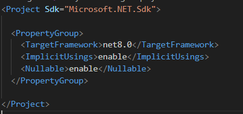

# Reflection

Reflection es la habilidad de un lenguaje de inspeccionar e invocar dinámicamente a clases, métodos, atributos, etc. en tiempo de ejecución.

Para .Net, es la habilidad de un programa de poder autoexaminarse con el objetivo de encontrar ensamblados (.dll), módulos, o información de tipos en tiempo de ejecución. A nivel de código vamos a tener clases y objetos que nos van a permitir referenciar a ensamblados, y a los tipos que se encuentren contenidos.

Se dice que un programa se refleja a sí mismo (de ahí el término reflection), a partir de extraer metadata de sus assemblies y de usar esa metadata para ciertos fines. Ya sea para informarle al usuario o para modificar su comportamiento.

Gracias al uso de reflection, tenemos la posibilidad de obtener información detallada de un objeto, sus métodos, e incluso crear objetos e invocar sus métodos en tiempo de ejecución sin la necesidad de realizar una referencia al ensamblado que contiene la clase y a su namespace.

Específicamente lo que nos permite usar Reflection es el namespace `System.Reflection`, que contiene clases e interfaces que nos permiten manejar todo lo mencionado anteriormente: ensamblados, tipos, métodos, estado, crear objetos, invocar métodos, etc.

## Estructura de un assembly/ensamblado

Un ensamblado es el resultado de compilar el programa, generalmente lo podremos ver como un .dll. Es la unidad mínima en .NET.

Los assemblies contienen paquetes, los paquetes contienen tipos y los tipos contienen estados. Reflection provee clases para encapsular estos elementos.

Como se dijo, es posible utilizar reflection para crear dinámicamente instancias de un tipo, obtener el tipo de un objeto existente e invocarle métodos y acceder a sus atributos de manera dinámica.

  

[Estructura de un assembly]

Algunas ventajas:

- Desacoplamiento a tipos externos
- Inspección de tipos de forma dinámica

Algunas desventajas:

- Performance overhead: las operaciones de reflection son generalmente lentas en comparación con operaciones realizadas directamente sobre tipos conocidos en tiempo de compilación. Esto es porque reflection involucra el descubrimiento de tipos en tiempo de ejecución y la inspección de metadata, que puede inferir en performance overhead, específicamente en aplicaciones performance-sensitive como aplicaciones de salud o económicas.

- Complejidad agregada: el código de reflection puede ser difícil de mantener y debugguear. Todas las tareas de reflection no son tan transparentes.

- Falta de seguridad por compilación: dado que reflection puede pasar chequeos en tiempo de compilación, los errores relacionados a mismatches o falta de miembros ocurrirán en tiempo de ejecución causando excepciones no esperadas.

- Riesgos de seguridad: el uso de assemblies por reflection propone una vulnerabilidad ya que estos assemblies pueden inspeccionar nuestra aplicación.

En resumen, a pesar de las desventajas, reflection sigue siendo una herramienta poderosa, particularmente en escenarios donde la flexibilidad que trae en tiempo de ejecución y el dinamismo sobre comportamientos es esencial. Sin embargo, es importante usar reflection de forma cautelosa y considerar caminos alternativos para mitigar posibles problemas.

## Ejemplo
- [Ejemplo de reflection real](https://github.com/CodeQuality-Uyu/unit-of-work/blob/main/CQ.UnitOfWork.Abstractions/Extensions/ExceptionExtensions.cs)
