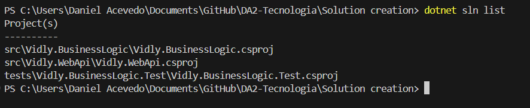
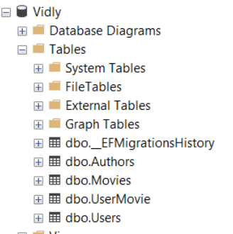

[⬅️ Volver - Pruebas Unitarias](https://github.com/IngSoft-DA2/DA2-Tecnologia/blob/unit-testing/README.md) > [⬅️ Volver - Configuración Pruebas Unitarias](https://github.com/IngSoft-DA2/DA2-Tecnologia/blob/unit-testing/config-unit-test-project.md)

# 💻 Creación de Proyecto de Prueba Unitaria por Comandos (CLI)

Sigue estos pasos para configurar tu proyecto de pruebas unitarias usando la terminal y la CLI de .NET.  
¡Optimiza tus pruebas agregando las herramientas recomendadas para un desarrollo profesional y efectivo! 🚀

---

## 1️⃣ Abrir terminal en el directorio de la solución

Para verificar que estás en el lugar correcto, ejecuta:

```bash
ls
```
Deberías ver el archivo `.sln` en la salida.

<p align="center">

</p>
<p align="center"><em>Terminal en directorio de la solución</em></p>

---

## 2️⃣ Entrar al directorio del proyecto de pruebas

```bash
cd Vidly.BusinessLogic.Test
```
<p align="center">

</p>
<p align="center"><em>Entrar a directorio de prueba</em></p>

---

## 3️⃣ Instalar Moq

**Moq** es el framework recomendado para simular dependencias en pruebas unitarias.

```bash
dotnet add package Moq
```
- 🎭 Permite crear mocks de objetos fácilmente.

<p align="center">

</p>
<p align="center"><em>Agregar Moq</em></p>

Verifica la instalación abriendo el archivo `Vidly.BusinessLogic.Test.csproj`:

<p align="center">

</p>
<p align="center"><em>Chequear Moq agregado</em></p>

---

## 4️⃣ Recomendación: Instala FluentAssertions

> **Se recomienda instalar FluentAssertions** para lograr una sintaxis más expresiva, legible y profesional en tus assertions.  
> Facilita la escritura de pruebas claras, robustas y fáciles de mantener.

```bash
dotnet add package FluentAssertions
```
- ✨ Permite encadenar múltiples assertions.
- 📣 Proporciona mensajes de error claros y descriptivos.
- 🧰 Cobertura para objetos, colecciones, cadenas, números, excepciones y más.

<p align="center">

</p>
<p align="center"><em>Agregar FluentAssertions</em></p>

Verifica la instalación abriendo el archivo `Vidly.BusinessLogic.Test.csproj`:

<p align="center">

</p>
<p align="center"><em>Chequear FluentAssertions agregado</em></p>

---

¡Listo!  
Ahora tu proyecto de pruebas unitarias está equipado para escribir tests efectivos, aislados y legibles.  
Sigue estas buenas prácticas para asegurar la calidad de tu código. 🧪✅
