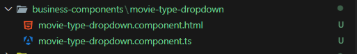
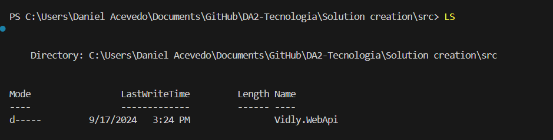

[⬅️ Volver - Pruebas Unitarias](https://github.com/IngSoft-DA2/DA2-Tecnologia/blob/unit-testing/README.md) > [⬅️ Volver - Configuración Pruebas Unitarias](https://github.com/IngSoft-DA2/DA2-Tecnologia/blob/unit-testing/config-unit-test-project.md)

# 🛠️ Configuración de Proyecto de Prueba Unitaria en Visual Studio

A continuación, se describe cómo agregar los paquetes recomendados **Moq** y **FluentAssertions** a tu proyecto de pruebas usando Visual Studio.  
¡Sigue estos pasos para potenciar la calidad y la legibilidad de tus pruebas! 🚀

---

## 🎭 Moq

1. **Haz click derecho** sobre el proyecto de prueba  
   → Selecciona **Manage NuGet Packages...**  
   

2. **Busca `Moq`** en la barra de búsqueda  
   

3. **Selecciona e instala** la última versión.  
   - Asegúrate que la fuente del paquete sea `nuget.org`  
   

4. **Verifica la instalación:**  
   - El paquete debe aparecer listado en la sección `Packages` del proyecto de prueba  
   

---

## ✨ FluentAssertions

> **Recomendación:**  
> Agrega **FluentAssertions** para obtener una sintaxis más expresiva y legible en tus assertions.  
> Esto mejorará la calidad y mantenibilidad de tus pruebas unitarias.

1. **Haz click derecho** sobre el proyecto de prueba  
   → Selecciona **Manage NuGet Packages...**  
   

2. **Busca `FluentAssertions`** en la barra de búsqueda  
   

3. **Selecciona e instala** la última versión.  
   - Asegúrate que la fuente del paquete sea `nuget.org`  
   

4. **Verifica la instalación:**  
   - El paquete debe aparecer listado en la sección `Packages` del proyecto de prueba  
   

---

¡Listo!  
Ya tienes integrados los paquetes recomendados para escribir **pruebas unitarias profesionales y efectivas** en tu proyecto. 💡
