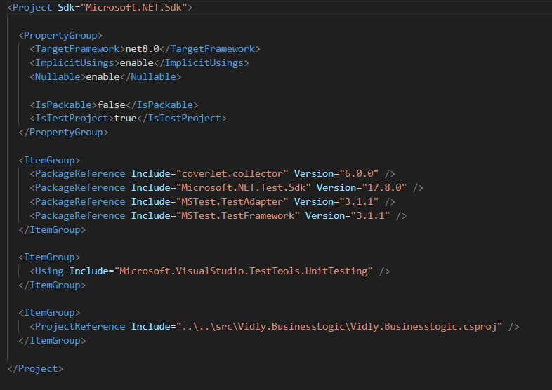

[⬅️ Volver a Pruebas Unitarias](https://github.com/IngSoft-DA2/DA2-Tecnologia/blob/unit-testing/README.md)

# 🚀 Creación de una Solución y Proyecto de Pruebas MSTest

El siguiente tutorial describe paso a paso cómo crear una solución en .NET, organizar los proyectos fuente y de pruebas, y configurar un proyecto MSTest para comenzar a escribir pruebas unitarias sobre tu lógica de negocio.

---

## 🟦 1. Creación de la Solución

> **¿Qué es una solución?**  
> Una solución (`.sln`) es un contenedor que agrupa múltiples proyectos de .NET (aplicaciones, bibliotecas, pruebas, etc.), facilitando la gestión y el desarrollo colaborativo.

### 📝 Pasos

1. **Abre una terminal** en el directorio donde quieras crear la solución.  
   Asegúrate de estar en el directorio raíz del repositorio clonado.

   ```bash
   ls
   ```

2. **Crea la solución:**  
   Reemplaza `<NombreNegocio>` por el nombre de tu negocio o proyecto.

   ```bash
   dotnet new sln -n <NombreNegocio>
   ```

   - `dotnet`: CLI de .NET
   - `new`: Crear un nuevo recurso
   - `sln`: Indica que quieres una solución
   - `-n`: Especifica el nombre

3. **Crea los directorios principales:**

   ```bash
   mkdir src
   mkdir tests
   ```

   - `src`: Contendrá el código fuente
   - `tests`: Contendrá los proyectos de pruebas

---

## 🧪 2. Creación del Proyecto de Pruebas MSTest

### 📂 Pasos

1. **Ubícate en la carpeta de pruebas:**

   ```bash
   cd tests
   ```

2. **Crea el proyecto MSTest:**  
   Reemplaza el nombre según tu contexto.

   ```bash
   dotnet new mstest -n Vidly.BusinessLogic.Test
   ```

   - `mstest`: Tipo de proyecto (pruebas unitarias)
   - `-n`: Nombre.  
     Ejemplo:  
     - `Vidly`: Contexto del negocio  
     - `BusinessLogic`: El proyecto a probar  
     - `Test`: Indica que es para pruebas

   

3. **Verifica la creación:**

   ```bash
   ls
   ```

   

---

## ⚙️ 3. Agregar Proyecto de Pruebas a la Solución

1. **Ve al directorio raíz de la solución:**

   ```bash
   cd ..
   ```

2. **Agrega el proyecto de pruebas a la solución:**

   ```bash
   dotnet sln add tests/Vidly.BusinessLogic.Test
   ```

   

3. **Verifica que fue agregado:**

   ```bash
   dotnet sln list
   ```

   

---

## 📦 4. Creación del Proyecto de Lógica de Negocio

1. **Ubícate en la carpeta de código fuente:**

   ```bash
   cd src
   ```

2. **Crea el proyecto Class Library:**

   ```bash
   dotnet new classlib -n Vidly.BusinessLogic
   ```

   

3. **Verifica la creación:**

   ```bash
   ls
   ```

   

   El archivo `Vidly.BusinessLogic.csproj` debe verse similar a:

   

---

## ➕ 5. Agregar Proyecto de Lógica a la Solución

1. **Vuelve a la raíz y agrega el proyecto a la solución:**

   ```bash
   cd ..
   dotnet sln add src/Vidly.BusinessLogic
   ```

2. **Verifica la adición:**

   ```bash
   dotnet sln list
   ```

   

---

## 🔗 6. Referenciar la Lógica de Negocio en el Proyecto de Pruebas

1. **Ubícate en el directorio del proyecto de pruebas:**

   ```bash
   cd tests
   cd Vidly.BusinessLogic.Test
   ```

2. **Agrega la referencia del proyecto de lógica de negocio:**

   ```bash
   dotnet add reference ../../src/Vidly.BusinessLogic/Vidly.BusinessLogic.csproj
   ```

   

3. **Verifica la referencia:**  
   Abre el archivo `Vidly.BusinessLogic.Test.csproj` y revisa que la referencia esté correctamente agregada.

   

---

## 🏁 ¡Listo!

Ahora tienes una solución organizada, con un proyecto de lógica de negocio y un proyecto de pruebas MSTest correctamente configurados y referenciados.  
Puedes comenzar a escribir tus pruebas unitarias para garantizar la calidad de tu código. 🧑‍💻✅

---

## 📚 Recursos útiles

- [Documentación oficial de MSTest](https://learn.microsoft.com/en-us/dotnet/core/testing/unit-testing-with-mstest)
- [Buenas prácticas para pruebas unitarias - Microsoft Docs](https://learn.microsoft.com/en-us/dotnet/core/testing/unit-testing-best-practices)
- [Pirámide de Testing](./unit-testing.md)
