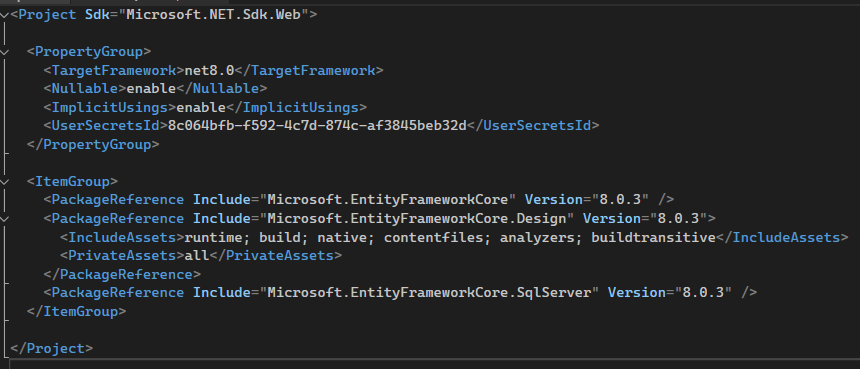
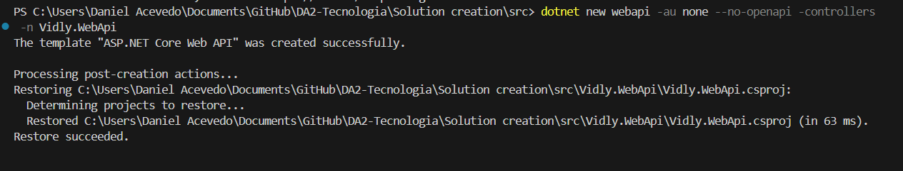
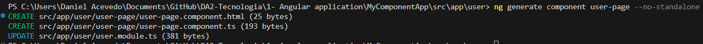
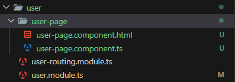
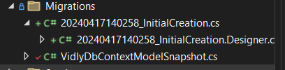
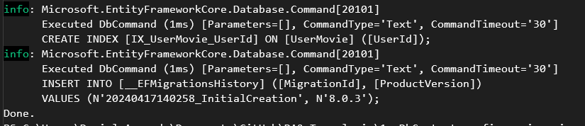

# Guía: Creación de una Solución y un Proyecto Web API en .NET

Esta guía te llevará paso a paso desde la creación de una solución base en .NET hasta la incorporación de un proyecto Web API siguiendo buenas prácticas de estructura y comandos recomendados.

---

## 1️⃣ Creación de la solución principal

1. **Ubícate en el directorio raíz de tu repositorio clonado**  
   Abre una terminal en la carpeta donde quieras crear tu solución. Puedes verificar que estás en el lugar correcto con:

   ```
   ls
   ```

2. **Crea la solución .NET**  
   Ejecuta el siguiente comando, reemplazando `<<NombreDelNegocio>>` por el nombre de tu negocio o proyecto:

   ```
   dotnet new sln -n <<NombreDelNegocio>>
   ```

   - `dotnet`: CLI de .NET
   - `new`: crear nuevo recurso
   - `sln`: tipo solución
   - `-n`: nombre de la solución (si no lo indicas, toma el nombre del directorio)

3. **Crea la estructura de carpetas recomendada**

   ```
   mkdir src
   mkdir tests
   ```

   - `src`: aquí irá el código fuente de tu aplicación.
   - `tests`: aquí irán los proyectos de pruebas unitarias y de integración.

---

## 2️⃣ Creación del proyecto Web API

### Paso previo: Navega hacia la carpeta `src`

Ubica la terminal dentro del directorio `src`:

```
cd src
```

---

### Crea el proyecto Web API

Ejecuta el siguiente comando (reemplaza `<<NombreDelNegocio>>` por el contexto de tu proyecto):

```
dotnet new webapi -au none --no-openapi -controllers -n <<NombreDelNegocio>>.WebApi
```

- `webapi`: tipo de proyecto a crear.
- `-n`: nombre del proyecto.
- `-au none`: sin autenticación por defecto.
- `--no-openapi`: no incluir Swagger/OpenAPI (puedes agregarlo después si lo deseas).
- `-controllers`: indica que usará controllers tradicionales (no minimal API).

**Ejemplo:**  
Si tu negocio es "Vidly", el comando sería:
```
dotnet new webapi -au none --no-openapi -controllers -n Vidly.WebApi
```

Verifica que el proyecto se creó correctamente:

```
ls
```

Deberías ver la carpeta correspondiente a tu nuevo proyecto WebApi.

---

### Agrega el proyecto Web API a la solución

1. **Vuelve a la raíz de la solución:**

   ```
   cd ..
   ```

2. **Agrega el proyecto a la solución:**

   ```
   dotnet sln add src/<<NombreDelNegocio>>.WebApi
   ```

   Esto vincula tu nuevo proyecto con la solución principal.

3. **Verifica los proyectos agregados a la solución:**

   ```
   dotnet sln list
   ```

   Deberías ver ahora tu proyecto WebApi listado.

---

### Referencia a la lógica de negocio (opcional, recomendado)

Si tienes un proyecto de lógica de negocio (por ejemplo, `<<NombreDelNegocio>>.BusinessLogic`), es importante que tu WebApi lo referencie para exponer sus funcionalidades.

1. Navega a la carpeta del proyecto WebApi:

   ```
   cd src
   cd <<NombreDelNegocio>>.WebApi
   ```

2. Agrega la referencia al proyecto de lógica de negocio:

   ```
   dotnet add reference ../<<NombreDelNegocio>>.BusinessLogic/<<NombreDelNegocio>>.BusinessLogic.csproj
   ```

   Esto asegura que la WebApi pueda utilizar los servicios y modelos definidos en la capa de negocio.

---

## 📸 Resumen visual (imágenes de referencia)

<p align="center">
  
  <br/>
  <em>Terminal ubicada en el directorio de la solución</em>
</p>

<p align="center">
  
  <br/>
  <em>Creación del proyecto Web API</em>
</p>

<p align="center">
  
  <br/>
  <em>Chequeo de proyecto creado</em>
</p>

<p align="center">
  
  <br/>
  <em>Agregado del proyecto a la solución</em>
</p>

<p align="center">
  
  <br/>
  <em>Chequeo de proyectos en la solución</em>
</p>

<p align="center">
  
  <br/>
  <em>Referencia de BusinessLogic en WebApi</em>
</p>

---

## 📝 Resumen de comandos clave

```bash
# Crear solución
dotnet new sln -n <<NombreDelNegocio>>

# Crear carpetas base
mkdir src
mkdir tests

# Crear proyecto Web API
cd src
dotnet new webapi -au none --no-openapi -controllers -n <<NombreDelNegocio>>.WebApi

# Volver a raíz y agregar proyecto a la solución
cd ..
dotnet sln add src/<<NombreDelNegocio>>.WebApi

# Listar proyectos en la solución
dotnet sln list

# Agregar referencia a la capa de lógica de negocio (opcional)
cd src/<<NombreDelNegocio>>.WebApi
dotnet add reference ../<<NombreDelNegocio>>.BusinessLogic/<<NombreDelNegocio>>.BusinessLogic.csproj
```

---

> **¡Listo!** Ya tienes tu solución estructurada y tu primer proyecto Web API creado y enlazado correctamente. Sigue este flujo cada vez que agregues un nuevo proyecto o capa a tu arquitectura.
