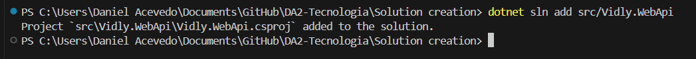
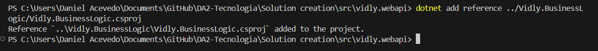

# Creación de proyecto Web API
A la solución creada en el paso [Creación de una solución](https://github.com/IngSoft-DA2/DA2-Tecnologia/blob/main/solution-creation.md) utilizada en la [Creación de proyecto MSTest](https://github.com/IngSoft-DA2/DA2-Tecnologia/blob/unit-testing/create-unit-test-project.md), le vamos a agregar un proyecto `Web API` que será nuestro punto de entrada para consumir nuestra aplicación.

- Abrir una terminal en el directorio de la solución. Para saber si estamos bien situados ejecutar `ls` y se debería de ver el archivo `.sln`

```
ls
```

Comandos:

- `ls`: lista elementos en un directorio

<p align="center">
  
</p>

<p align="center">
[Terminal en directorio]
</p>

- Para crear el proyecto `Web API` nos situaremos en la carpeta `src` con la terminal ejecutando:

```
cd src
```

Comandos:

- `cd`: movimiento a un directorio en particular


- Una vez parados en la carpeta `src` con la terminal, crearemos un proyecto `Web API` ejecutando lo siguiente

```
  dotnet new webapi -au none --no-openapi -controllers -n <<Nombre del negocio>>.WebApi
```

Comandos y parámetros:

- `new`: crea un nuevo proyecto
- `webapi`: tipo de proyecto a crear
- `-n`: nombre del proyecto
- `<<Nombre del negocio>>.WebApi`: `<<Nombre del negocio>>` es el contexto del negocio, `WebApi` es un nombre que me ayuda a identificar como será expuesta mi aplicación
- `au`: sirve para configurar el tipo de autenticación que queremos que se requiera, el valor `none` es para indicar que no queremos que se configure.
- `no-openapi`: para indicar que no se quiere integrar `Swagger` en la web api.
- `controllers`: para indicar que se usen controllers y no una `minimal-api`

<p align="center">

</p>

<p align="center">
[Creacion proyecto Web API]
</p>

- Chequear que se creó el proyecto. En el directorio ejecutar `ls`.

```C#
ls
```

<p align="center">

</p>
<p align="center">
[Chequear creacion de proyecto]
</p>

- Ahora dicho proyecto `Web API` lo debemos de agregar a la solucion. Para esto debemos situarnos con la terminal en el directorio donde esta la solución`.sln`, para esto ejecutaremos:

```
cd ..
```

Comandos:

- `cd ..`: nos posiciona la terminal en un directorio para atrás

Una vez que estemos bien situados, para agregar el proyecto a la solución`.sln` debemos ejecutar:

```C#
dotnet sln add src/Vidly.WebApi
```

Comandos y parametros

- `sln`: operar con solucion
- `add`: agregar proyecto a la solucion
- `src/Vidly.WebApi`: nombre del proyecto a agregar a la solucion

<p align="center">

</p>

<p align="center">
[Agregar proyecto a solucion]
</p>

- Chequear que se agregó el proyecto a la solucion

```C#
dotnet sln list
```

Comandos:

- `sln`: operar con solucion
- `list`: listar proyectos en solucion

<p align="center">

</p>

<p align="center">
[Chequear que se agregó a la solucion]
</p>

- Como este proyecto sera el que exponga nuestra aplicación por la `web`, este tiene que referenciar a dicho proyecto
```
cd src
cd Vidly.WebApi
dotnet add reference ../Vidly.BusinessLogic/Vidly.BusinessLogic.csproj
```
<p align="center">

</p>

<p align="center">
[Chequear que se agregó la referencia de BusinessLogic en WebApi]
</p>
