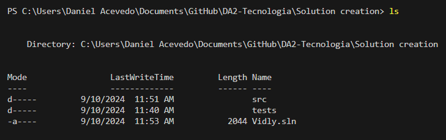

[🔙 Indice](https://github.com/IngSoft-DA2/DA2-Tecnologia/tree/web-api#indice) → [🏠 Main](https://github.com/IngSoft-DA2/DA2-Tecnologia/tree/main)

# 🚀 Guía Paso a Paso: Creación de una Solución y Proyecto Web API en .NET

¡Bienvenido! Esta guía te acompaña desde cero para crear tu solución base en .NET y sumarle un proyecto Web API, siguiendo buenas prácticas y con comandos recomendados.  
Prepárate para estructurar tu aplicación como un pro. 🎯

---

## 1️⃣ Creación de la Solución Principal

### 🗂️ Paso 1: Ubícate en tu directorio raíz

Abre una terminal en la carpeta donde quieras crear tu solución.  
Verifica tu ubicación:

```bash
ls
```
---

### 🛠️ Paso 2: Crea la solución .NET

Ejecuta el siguiente comando, reemplazando `<<NombreDelNegocio>>` por el nombre de tu negocio o proyecto:

```bash
dotnet new sln -n <<NombreDelNegocio>>
```

> ℹ️ **Desglose:**  
> - `dotnet`: CLI de .NET  
> - `new`: crear nuevo recurso  
> - `sln`: tipo solución  
> - `-n`: nombre de la solución (si lo omites, toma el nombre del directorio)

---

### 🗃️ Paso 3: Estructura de carpetas recomendada

```bash
mkdir src
mkdir tests
```
- 📁 **src:** código fuente de tu aplicación  
- 🧪 **tests:** proyectos de pruebas unitarias e integración

---

## 2️⃣ Creación del Proyecto Web API

### 🚶‍♂️ Paso Previo: Entra a la carpeta `src`

Ubica la terminal dentro de `src`:

```bash
cd src
```

---

### ✨ Crea el Proyecto Web API

Ejecuta el siguiente comando (reemplaza `<<NombreDelNegocio>>` por el contexto de tu proyecto):

```bash
dotnet new webapi -au none --no-openapi -controllers -n <<NombreDelNegocio>>.WebApi
```

> 📝 **Opciones usadas:**  
> - `webapi`: tipo de proyecto  
> - `-n`: nombre del proyecto  
> - `-au none`: sin autenticación  
> - `--no-openapi`: sin Swagger/OpenAPI (puedes agregarlo más adelante)  
> - `-controllers`: controllers tradicionales (no minimal API)

**Ejemplo:**  
Si tu negocio es "Vidly":
```bash
dotnet new webapi -au none --no-openapi -controllers -n Vidly.WebApi
```

Verifica que se creó correctamente:
```bash
ls
```
🟢 Deberías ver la carpeta de tu nuevo proyecto WebApi.

---

### 🔗 Agrega el Proyecto Web API a la Solución

1. ⬆️ Vuelve a la raíz de la solución:
    ```bash
    cd ..
    ```

2. ➕ Agrega el proyecto a la solución:
    ```bash
    dotnet sln add src/<<NombreDelNegocio>>.WebApi
    ```

3. 📋 Verifica los proyectos agregados:
    ```bash
    dotnet sln list
    ```
    👀 Ahora deberías ver tu proyecto WebApi listado.

---

### 🧩 Referencia a la Lógica de Negocio (Opcional y Recomendado)

Si tienes un proyecto de lógica de negocio (ejemplo: `<<NombreDelNegocio>>.BusinessLogic`), haz que tu WebApi lo referencie para exponer sus funcionalidades.

1. 📂 Navega al proyecto WebApi:
    ```bash
    cd src
    cd <<NombreDelNegocio>>.WebApi
    ```

2. 🔗 Agrega la referencia:
    ```bash
    dotnet add reference ../<<NombreDelNegocio>>.BusinessLogic/<<NombreDelNegocio>>.BusinessLogic.csproj
    ```

    ✅ Así tu WebApi podrá usar servicios y modelos de la capa de negocio.

---

## 🖼️ Resumen Visual

<p align="center">
  
  <br/>
  <em>📍 Terminal ubicada en el directorio de la solución</em>
</p>

<p align="center">
  
  <br/>
  <em>🚧 Creación del proyecto Web API</em>
</p>

<p align="center">
  
  <br/>
  <em>🔎 Chequeo de proyecto creado</em>
</p>

<p align="center">
  
  <br/>
  <em>🔗 Agregado del proyecto a la solución</em>
</p>

<p align="center">
  
  <br/>
  <em>📑 Chequeo de proyectos en la solución</em>
</p>

<p align="center">
  
  <br/>
  <em>🧩 Referencia de BusinessLogic en WebApi</em>
</p>

---

## 📝 Comandos Clave Resumidos

```bash
# 🏗️ Crear solución
dotnet new sln -n <<NombreDelNegocio>>

# 📁 Crear carpetas base
mkdir src
mkdir tests

# ✨ Crear proyecto Web API
cd src
dotnet new webapi -au none --no-openapi -controllers -n <<NombreDelNegocio>>.WebApi

# 🔗 Volver a raíz y agregar proyecto a la solución
cd ..
dotnet sln add src/<<NombreDelNegocio>>.WebApi

# 🗂️ Listar proyectos en la solución
dotnet sln list

# 🧩 Agregar referencia a la capa de lógica de negocio (opcional)
cd src/<<NombreDelNegocio>>.WebApi
dotnet add reference ../<<NombreDelNegocio>>.BusinessLogic/<<NombreDelNegocio>>.BusinessLogic.csproj
```

---

> 🎉 **¡Listo!** Tu solución está estructurada y tu primer proyecto Web API está creado y enlazado correctamente.  
> 🔄 Sigue este flujo cada vez que sumes un nuevo proyecto o capa a tu arquitectura.

---
