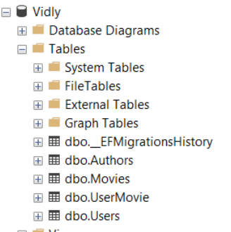

[🔙 Indice](https://github.com/IngSoft-DA2/DA2-Tecnologia/tree/ef-core#indice) → [🏠 Main](https://github.com/IngSoft-DA2/DA2-Tecnologia/tree/main?tab=readme-ov-file#da2-tecnologia--dise%C3%B1o-de-aplicaciones-2)

# 🌱 Primeros pasos con EF Core

---

## 📦 Instalación de EF Core

Para comenzar a utilizar EF Core en tu aplicación, primero debes instalar el paquete principal:

- `Microsoft.EntityFrameworkCore`

Puedes hacerlo de dos maneras:
- [Visual Studio](https://github.com/daniel18acevedo/DA2-Tecnologia/blob/ef-core/install-ef-core-visual-studio.md) 🚀
- [Por comandos](https://github.com/daniel18acevedo/DA2-Tecnologia/blob/ef-core/install-ef-core-dotnet-cli.md) 💻

---

## 🏗️ Creación del contexto concreto

El contexto concreto representa tu acceso directo a la base de datos. Su clase debe ser específica para tu negocio y facilitar la configuración de la conexión.

```csharp
public sealed class VidlyDbContext : DbContext
{
  // Código aquí
}
```

> 📝 El nombre del contexto debe reflejar claramente a qué negocio pertenece, permitiendo identificar rápidamente qué base de datos y qué tablas se manejarán.

Si tienes varios contextos y distintos ORMs, puedes ser más explícito con el nombre:

```csharp
public sealed class VidlyEfCoreDbContext : DbContext
{
  // Código aquí
}
```

Esta nomenclatura es útil para distinguir entre contextos que emplean diferentes tecnologías, sean relacionales o no.

---

## 🗃️ Configuración de tablas

Dentro del contexto concreto, deberás definir los sets de tablas (`DbSet`) con los que trabajará tu aplicación:

```csharp
public sealed class VidlyDbContext : DbContext
{
  public DbSet<Movie> Movies { get; set; }
  public DbSet<User> Users { get; set; }
}
```

Las propiedades de tipo `DbSet` indican qué tablas se crearán en la base de datos. El nombre de la propiedad define el nombre de la tabla resultante.

---

## 🔗 Configuración de la conexión a la base de datos

La forma de conectar tu contexto a la base de datos debe ser flexible, ya que puede variar según el entorno. Por ejemplo:

- **Producción**: datos reales de usuarios finales.
- **Desarrollo**: datos similares a producción para pruebas.
- **QA**: ambiente de pruebas libre.
- **Local**: datos personales de cada desarrollador.

El constructor del contexto debe permitir recibir la configuración adecuada según el entorno:

```csharp
public sealed class VidlyDbContext : DbContext
{
  public DbSet<Movie> Movies { get; set; }
  public DbSet<User> Users { get; set; }
  public VidlyDbContext(DbContextOptions options)
    : base(options)
    {
    }
}
```

Si tienes múltiples contextos concretos, especifica el tipo en las opciones:

```csharp
public sealed class VidlyDbContext : DbContext
{
  public DbSet<Movie> Movies { get; set; }
  public DbSet<User> Users { get; set; }
  public VidlyDbContext(DbContextOptions<VidlyDbContext> options)
    : base(options)
    {
    }
}
```

> ⚡ ¡Toda interacción con la base debe hacerse a través de un contexto concreto!

---

## 🛠️ Configuración del motor de base de datos

Antes de usar el contexto, debes configurarlo para utilizar el proveedor de base de datos adecuado en tu ambiente.  
Por ejemplo, en una Web API en .NET 8, esto se hace en `Program.cs`.

EF Core soporta varios proveedores, como:
- SQL Server
- SQLite
- MySQL
- PostgreSQL

Instala el paquete del proveedor que necesites. Ejemplo para SQL Server:
- [Visual Studio](https://github.com/daniel18acevedo/DA2-Tecnologia/blob/ef-core/install-sql-server-visual-studio.md)
- [Por comandos](https://github.com/daniel18acevedo/DA2-Tecnologia/blob/ef-core/install-sql-server-dotnet-cli.md)

Código de ejemplo para configurar el contexto:

```csharp
var builder = WebApplication.CreateBuilder(args);
builder.Services.AddControllers();

var services = builder.Services;
var configuration = builder.Configuration;

var vidlyConnectionString = configuration.GetConnectionString("Vidly");
if(string.IsNullOrEmpty(vidlyConnectionString))
{
  throw new Exception("Missing Vidly connection string");
}

services.AddDbContext<DbContext, VidlyDbContext>(options => options.UseSqlServer(connectionString));

var app = builder.Build();
app.MapControllers();
app.Run();
```

> 📄 El connection string debe estar definido en tu archivo de configuración según el ambiente.

Ejemplo en `appsettings.json` (no debe estar ignorado por GitHub):

```json
{
  "ConnectionStrings": {
    "Vidly": ""
  }
}
```

Ejemplo en `appsettings.Development.json` (debe estar ignorado por GitHub):

```json
{
  "ConnectionStrings": {
    "Vidly": "test"
  }
}
```

---

## 🐳 SQL Server con Docker: ¡Guía rápida y accesible!

> 🐋 ¿Quieres usar SQL Server en tu entorno de desarrollo local sin instalarlo directamente?  
> ¡Usar Docker es una excelente opción!  
> Accede directamente a la guía detallada aquí ➡️ [Guía: Usar SQL Server con Docker](https://github.com/daniel18acevedo/DA2-Tecnologia/blob/ef-core/sql-with-docker.md)

Esta guía te explica cómo levantar un contenedor con SQL Server, configurar contraseñas, puertos, y conectar tu aplicación.  
Es especialmente útil para desarrolladores en MacOS, Linux o quienes prefieren entornos aislados.

Al crear el connection string para MacOS/Docker, reemplaza los valores según tu configuración:

```json
{
  "ConnectionStrings":{
    "Vidly": "Server=localhost, <puerto>; Database=Vidly; User ID=<usuario>; Password=<password>; TrustServerCertificate=true;"
  }
}
```

Sustituye:
- `<usuario>`: el usuario creado en el contenedor
- `<password>`: la contraseña de ese usuario
- `<puerto>`: el puerto expuesto por el contenedor Docker

---

## 🧩 Migraciones: tu primer migración

Para crear migraciones instala:

- **Microsoft.EntityFrameworkCore.Design**: para que EF Core interprete las entidades y modele las tablas.

Instalación:
- [Visual Studio](https://github.com/daniel18acevedo/DA2-Tecnologia/blob/ef-core/install-migrations-visual-studio.md)
- [Por comandos](https://github.com/daniel18acevedo/DA2-Tecnologia/blob/ef-core/install-migrations-dotnet-cli.md)

Pasos para crear y ejecutar la migración:

### 1. Ubícate en la raíz de la solución

```shell
ls
```

Comandos:
- `ls`: lista elementos en un directorio.

---

### 2. Instala las herramientas EF Core

```shell
dotnet tool install --global dotnet-ef
```

Comandos:
- `dotnet`: ejecuta comandos de .NET.
- `tool`: parámetro para trabajar con herramientas.
- `install`: instala una herramienta.
- `--global`: instala la herramienta de forma global en el sistema.
- `dotnet-ef`: herramienta de Entity Framework Core para crear y aplicar migraciones.

---

### 3. Ingresa al proyecto donde está el contexto

```shell
cd Vidly.WebApi
```

Comandos:
- `cd`: ingresar a un directorio.
- `Vidly.WebApi`: nombre del directorio al que acceder.

---

### 4. Verifica que estás en el directorio correcto

```shell
ls
```

Comandos:
- `ls`: lista elementos en el directorio actual.

---

### 5. Crea la primer migración

No es necesario un connection string válido para crear la migración, pero debe tener algún valor.

```shell
dotnet ef migrations add InitialCreation --verbose
```

Comandos:
- `dotnet`: ejecuta comandos de .NET.
- `ef`: parámetro para operar con Entity Framework Core.
- `migrations`: parámetro para trabajar con migraciones.
- `add`: indica la creación de una migración.
- `InitialCreation`: nombre de la migración.
- `--verbose`: imprime en detalle lo que se está ejecutando y los errores.

#### 5.1 Contexto en otro proyecto

Si el contexto está en otro proyecto distinto al de la configuración, ejecuta el comando desde el proyecto del contexto y especifica el startup project:

```shell
dotnet ef migrations add InitialCreation --verbose --startup-project ../<directorio del proyecto de web api>
```

Comando extra:
- `--startup-project`: indica el proyecto donde está la configuración del contexto para usar en tiempo de diseño.

---

### 6. Chequear que se creó la migración

<p align="center">

</p>

<p align="center">
[Resultado de creación exitoso]
</p>

<p align="center">

</p>

<p align="center">
[Carpeta de migraciones con las clases]
</p>

- Se crea una carpeta `Migrations` con las clases generadas.
- Más info: [resultado de migración](https://github.com/daniel18acevedo/DA2-Tecnologia/blob/ef-core/migration-result.md).

---

### 7. Ejecuta la migración

Tu connection string en `appsettings.Development.json` debe ser válido para SQL Server.

Ejemplo para Windows:

```json
{
  "ConnectionStrings":{
    "Vidly": "Server=localhost;Database=Vidly; Integrated Security=True;Trusted_Connection=True;MultipleActiveResultSets=True;TrustServerCertificate=True"
  }
}
```

Descarga SQL Server para Windows [aquí](https://www.microsoft.com/en-us/sql-server/sql-server-downloads).

Ejemplo para MacOS (opciones):

```json
{
  "ConnectionStrings":{
    "Vidly": "Server=localhost, <puerto>; Database=Vidly; User ID=<usuario>; Password=<password>; Integrated Security=True; Trusted_Connection=True;"
  }
}
```

<p align="center">
  [Opcion 1]
</p>
  
```json
{
  "ConnectionStrings":{
    "Vidly": "Server=localhost, <puerto>; Database=Vidly; User ID=<usuario>; Password=<password>; TrustServerCertificate=true;"
  }
}
```
<p align="center">
  [Opcion 2]
</p>

> 🔗 **¡No olvides que si quieres usar Docker para SQL Server, la guía está disponible aquí:**  
> [Guía: Usar SQL Server con Docker](https://github.com/daniel18acevedo/DA2-Tecnologia/blob/ef-core/sql-with-docker.md)

Sustituye:
- `<usuario>`: por el usuario creado en SQL Server.
- `<password>`: por la contraseña de ese usuario.
- `<puerto>`: por el puerto indicado en la creación del contenedor.

Para aplicar la migración y actualizar la base de datos:

```shell
dotnet ef database update --verbose
```

Comandos:
- `database`: parámetro para operar con la base de datos.
- `update`: parámetro para actualizar la base.
- `--verbose`: imprime en detalle lo que se está ejecutando y los errores.

Si la migración está en otro proyecto distinto al de la configuración:

```shell
dotnet ef database update --verbose --startup-project ../<directorio del proyecto de web api>
```

Comando extra:
- `--startup-project`: indica el proyecto donde está la configuración del contexto para usar en tiempo de diseño.

<p align="center">

</p>

<p align="center">
[Resultado en consola de ejecutar la migración]
</p>

---

### 8. Chequear la creación de la base de datos

Utiliza el cliente de tu elección ([SQL Server Management Studio (SSMS)](https://learn.microsoft.com/en-us/sql/ssms/download-sql-server-management-studio-ssms?view=sql-server-ver16) o [Azure Data Studio](https://learn.microsoft.com/en-us/sql/azure-data-studio/download-azure-data-studio?view=sql-server-ver16)) para visualizar la base creada.

<p align="center">

</p>

<p align="center">
[Base de datos en Management Studio]
</p>

---

## 📚 Material de lectura recomendado

- [Iniciar migraciones](https://learn.microsoft.com/en-us/ef/core/managing-schemas/migrations/?tabs=dotnet-core-cli)
- [Aplicar migraciones](https://learn.microsoft.com/en-us/ef/core/managing-schemas/migrations/applying?tabs=dotnet-core-cli)
- [Gestionar migraciones](https://learn.microsoft.com/en-us/ef/core/managing-schemas/migrations/managing?tabs=dotnet-core-cli)
- [Configuración de contexto para migraciones](https://learn.microsoft.com/en-us/ef/core/cli/dbcontext-creation?tabs=dotnet-core-cli)
- [Herramientas EF Core](https://learn.microsoft.com/en-us/ef/core/cli/dotnet)

---

¡Sigue estos pasos, experimenta y aprende! 😃
