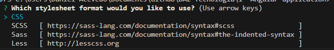

[🔙 Indice](https://github.com/IngSoft-DA2/DA2-Tecnologia/tree/filters?tab=readme-ov-file#indice) -> [🏠 Main](https://github.com/IngSoft-DA2/DA2-Tecnologia/tree/main?tab=readme-ov-file#-temas-y-ejemplos-de-c%C3%B3digo)

# ✨ Filtros en ASP.NET Core

Los **filtros** en ASP.NET Core permiten ejecutar código *antes* y/o *después* de procesar una solicitud (_request_). Son piezas clave para controlar la lógica en el ciclo de vida de una petición HTTP dentro de tu aplicación web.

---

## 🚦 ¿Cómo funcionan los filtros?

Los filtros son ejecutados por ASP.NET Core como parte de la **pipeline** de procesamiento de una request. En otras palabras, son tareas que se pueden interponer en diferentes etapas del flujo de una petición.

<div align="center">
  
  <br/>
  <strong>Lista de tareas por las cuales pasa una request</strong>
</div>

En la imagen puedes observar las tareas predefinidas del framework:

- **Other Middleware**: Middleware personalizado creado por el desarrollador.
- **Routing Middleware**: Enruta la request hacia el controlador correspondiente.
- **Action Selection**: Selecciona el método del controlador que será invocado.
- **Filter Pipeline**: Lugar donde los filtros son ejecutados.

---

## 🧩 Tipos de filtros

Cada filtro se ejecuta en una etapa específica de la **pipeline**. Los principales tipos son:

| Tipo           | Descripción                                                                                             |
|----------------|--------------------------------------------------------------------------------------------------------|
| 🔑 Authorization | Primeros en ejecutarse. Determinan si el usuario está autorizado.                                     |
| 📦 Resource      | Se ejecutan después de los Authorization. Permiten lógica antes y después de los demás filtros.       |
| ⚡ Action        | Justo antes y después del método del controlador. Pueden modificar argumentos y resultados.           |
| 📍 Endpoint      | Pueden modificar argumentos y resultados en endpoints de clase y de acción.                           |
| 💥 Exception     | Aplican políticas globales para manejar excepciones antes de responder al cliente.                    |
| 📝 Result        | Antes y después de dar una respuesta. Útiles para lógica de formateo.                                 |

<div align="center">
  
  <br/>
  <strong>Interacción entre filtros</strong>
</div>

---

## 🕰️ Definición y orden de ejecución

Los filtros pueden aplicarse en diferentes niveles:

- 🌍 Global (para toda la app)
- 📂 Controller (para un controlador específico)
- 🔧 Método (para una acción específica)

El **orden de ejecución** depende del nivel de alcance:

```plaintext
El código de antes en un filtro global
  El código de antes de un filtro de controller
    El código de antes de un filtro de método
      Código a invocar
    El código de después de un filtro de método
  El código de después de un filtro de controller
El código de después de un filtro global
```

### Ejemplo: Orden en la ejecución

| Secuencia | Alcance del filtro | Método del filtro      |
|-----------|-------------------|-----------------------|
| 1         | Global            | OnActionExecuting     |
| 2         | Controller        | OnActionExecuting     |
| 3         | Método            | OnActionExecuting     |
| 4         | -                 | Código                |
| 5         | Método            | OnActionExecuted      |
| 6         | Controller        | OnActionExecuted      |
| 7         | Global            | OnActionExecuted      |

---

## 🔢 Sobrescribir el orden de ejecución

Puedes modificar el orden usando la interfaz `IOrderedFilter` y su propiedad `Order`.

- Filtros con menor valor en `Order` se ejecutan primero.
- Filtros con mayor valor en `Order` se ejecutan después.

#### Ejemplo

```csharp
[SampleActionFilter(Order = int.MinValue)]
public class ControllerFiltersController : Controller
{
    // ...
}
```

```csharp
builder.Services.AddControllers(options =>
{
    options.Filters.Add<GlobalSampleActionFilter>(int.MaxValue);
});
```

Así, el filtro con `Order = int.MinValue` se ejecuta antes que el de `int.MaxValue`, independientemente del alcance.

---

## ✋ Cancelar ejecución de un filtro

Un filtro puede interrumpir el procesamiento de la request en cualquier momento, asignando un valor a la propiedad `Result` del parámetro `context`.

---

## 🧑‍🔧 Filtros con dependencias

- **Por instancia**: La misma instancia se usa para cada request.
- **Por tipo**: Se crea una nueva instancia para cada request (con dependencias inyectadas desde el contenedor de servicios).

### 🚨 Importante
Los filtros agregados como atributos directamente a nivel de controlador o método no pueden tener constructores con dependencias para inyección automática.

---

## 🛠️ ServiceFilterAttribute

Permite obtener una instancia del filtro desde el contenedor de servicios (*Dependency Injection*).

**Definición del filtro:**

```csharp
public class CustomFilterService(IMyDependency dependency) : IActionFilter
{
    public void OnActionExecuting(ResultExecutingContext context)
    {
      dependency.Action();
    }
    public void OnActionExecuted(ResultExecutedContext context)
    {
      dependency.Action();
    }
}
```

**Registro en Program.cs**

```csharp
builder
.Services
.AddScoped<CustomFilterService>()
.AddScoped<IMyDependency, MyDependency>();
```

**Uso en metodo de controller**

```csharp
[ServiceFilter<CustomFilterService>(IsReusable = false)]
public void MyActionOnController()
{
  // ...
}
```

---

## 🧬 TypeFilterAttribute

Similar al anterior, pero el tipo del filtro no es resuelto por el contenedor DI, sino que se instancia manualmente. Permite pasar argumentos al filtro.

**Definición del filtro:**

```csharp
public class CustomFilterService(
IMyDependency dependency,
string parameter1,
string parameter2)
: IActionFilter
{
    // ...
}
```

**Registro en Program.cs**

```csharp
builder
.Services
.AddScoped<IMyDependency, MyDependency>();
```

**Uso en metodo de controller:**

```csharp
[TypeFilter(typeof(CustomFilter), Arguments = ['custom','arguments'], IsReusable = false)]
public void MyActionOnController()
{
  // ...
}
```

> Apesar de que el tipo del servicio (el filtro en si: CustomFilter en este caso) en TypeFilterAttribute no necesita ser declarado en el contenedor de servicios, sus dependencias si van a ser resueltas usando este y opcionalmente aceptar otros argumentos en el constructor resueltos por TypeFilterAttribute

---

## 🏷️ Filtros como atributos

- Deben heredar de `Attribute`.
- El constructor debe ser sin parámetros (o con parámetros proporcionales).
- **No** permiten inyección automática de dependencias.

**Ejemplo:**

```csharp
public sealed class CustomFilterAttribute : Attribute, // indicar tipo de filtro implementando la interfaz correspondiente
{
  // ...
}
```

**Uso:**

```csharp
[ApiController]
[Route("endpoints")]
[CustomFilter]
public sealed class MyController : ControllerBase
{
  [HttpGet]
  [CustomFilter]
  public void MyAction()
  {
    // ...
  }
}
```

Si necesita dependencias, debe obtenerlas manualmente:

```csharp
public sealed class CustomFilterAttribute : Attribute // tipo de filtro
{
  public void FilterFunction(FilterContext context)
  {
    var dependency = context.HttpContext.RequestServices.GetRequiredService<IMyDependency>();
  }
}
```

> ✅ Aquí puedes usar cualquier ciclo de vida para la dependencia.

---

# ⚡️ Filtros vs Middlewares en ASP.NET Core

En ASP.NET Core, tanto los **filtros** como los **middlewares** permiten ejecutar lógica personalizada durante el procesamiento de una solicitud HTTP. Sin embargo, tienen diferencias clave en su propósito y aplicación.

---

## 🧠 ¿Qué son?

| Concepto      | Middleware                                                                                         | Filtro                                                                                          |
|---------------|---------------------------------------------------------------------------------------------------|-------------------------------------------------------------------------------------------------|
| Definición    | Componente que se encadena en la pipeline HTTP para procesar requests/responses.                  | Componente que se ejecuta en etapas específicas dentro del ciclo MVC (antes/después de acciones) |
| Alcance       | Global, afecta todas las requests.                                                                | Puede ser global, por controlador o por acción específica.                                      |
| Contexto      | Trabaja a nivel de la request completa (antes de llegar a MVC).                                   | Trabaja dentro del contexto MVC (Controllers y Actions).                                        |
| Tipos         | Request, Response, Custom.                                                                        | Authorization, Resource, Action, Result, Exception, Endpoint.                                   |

---

## 📝 Ejemplo Visual

```plaintext
Request
  ↓
[Middlewares]
  ↓
[Routing]
  ↓
[Controllers]
  ↓
[Filtros]
  ↓
[Action Methods]
  ↓
Response
```

---

## 🔍 Diferencias Clave

- **Middlewares**
  - Se ejecutan desde que la request entra a la aplicación hasta que sale la respuesta.
  - Son ideales para lógica transversal (logging, autenticación, CORS, manejo de errores global).
  - Se configuran en el archivo `Program.cs` o `Startup.cs`.
  - No tienen conocimiento específico del MVC ni de acciones.

- **Filtros**
  - Se ejecutan en puntos específicos del ciclo MVC (antes/después de acciones, resultados, excepciones).
  - Permiten lógica más granular y relacionada a la ejecución de controladores y acciones (autorización, validación de modelos, formateo de respuestas).
  - Pueden aplicarse globalmente, por controlador o por acción.
  - Acceden al contexto de la acción, al modelo y a los resultados.

---

## 🚀 ¿Cuándo usar cada uno?

| Usar Middleware para...                  | Usar Filtro para...                               |
|------------------------------------------|---------------------------------------------------|
| Autenticación/Autorización global        | Autorización en acciones específicas              |
| Manejo de errores global                 | Manejo de excepciones en acciones                 |
| Logging, monitoring                      | Validación de modelos en acciones                 |
| Manipulación de headers/cookies globales | Modificación de resultados de acciones            |
| CORS                                     | Lógica que depende del contexto de Controller/Action |

---

## 🤔 Ejemplo de Middleware

```csharp
app.Use(async (context, next) =>
{
    // Lógica antes de la request
    await next.Invoke();
    // Lógica después de la response
});
```

## 🧩 Ejemplo de Filtro

```csharp
public class CustomActionFilter : IActionFilter
{
    public void OnActionExecuting(ActionExecutingContext context)
    {
        // Lógica antes de la acción
    }
    public void OnActionExecuted(ActionExecutedContext context)
    {
        // Lógica después de la acción
    }
}
```

---

## 🌍 ¿Qué son los CORS?

**CORS** (*Cross-Origin Resource Sharing*) es un mecanismo de seguridad en los navegadores web que controla cómo las páginas pueden hacer solicitudes a recursos que están en diferentes dominios, protocolos o puertos.

Por defecto, los navegadores bloquean las solicitudes "cross-origin" para proteger la información del usuario. Sin embargo, con CORS, un servidor puede indicar explícitamente qué fuentes externas tienen permiso para acceder a sus recursos.

> **Ejemplo:**  
> Si tu aplicación web está en `https://midominio.com` y necesita consumir una API en `https://api.otrodominio.com`, el servidor de la API debe habilitar CORS para permitir esa comunicación.

---

**En resumen:**  
CORS es la manera en que los servidores y navegadores gestionan las solicitudes entre diferentes orígenes, manteniendo la seguridad y permitiendo integración entre sistemas web distribuidos.

---

## 🌐 Ejemplo de configuración de Middleware `UseCors` para aceptar cualquier verbo, header y origen

Para aceptar **todas** las solicitudes HTTP, sin restricciones de verbo, header ni origen, puedes configurar el middleware CORS en tu aplicación ASP.NET Core de la siguiente manera:

```csharp
using Microsoft.AspNetCore.Builder;

var builder = WebApplication.CreateBuilder(args);

// Configura CORS para permitir cualquier origen, método y header
builder.Services.AddCors(options =>
{
    options.AddPolicy("Permisivo", policy =>
    {
        policy
            .AllowAnyOrigin()    // Permite cualquier origen
            .AllowAnyMethod()    // Permite cualquier verbo HTTP (GET, POST, PUT, DELETE, etc.)
            .AllowAnyHeader();   // Permite cualquier header
    });
});

var app = builder.Build();

// Aplica el middleware CORS con la política permisiva
app.UseCors("Permisivo");

// ... otros middlewares y configuración

app.MapControllers();
app.Run();
```

### 🛡️ Advertencia

> **Permitir cualquier origen, método y header puede exponer tu aplicación a riesgos de seguridad.**  
> Utiliza esta configuración solo en entornos de desarrollo, pruebas, o APIs públicas donde no hay información sensible involucrada.

---

## 🛠️ Configuración de Middleware CORS: ¿Qué implica cada forma?

### 1️⃣ Usando `AddCors` + Política nombrada

Cuando configuras CORS usando `builder.Services.AddCors` con una política nombrada y luego la aplicas mediante `app.UseCors("Permisivo")`, estás:

- **Definiendo explícitamente una política CORS** en el contenedor de servicios.
- Permitiendo reutilizar esa política en diferentes partes de tu aplicación.
- Facilitando la gestión centralizada y el mantenimiento de reglas CORS.
- Permitiendo que puedas tener **múltiples políticas CORS** y seleccionar cuál aplicar en cada endpoint o globalmente.

**Ejemplo:**
```csharp
// Definición de la política
builder.Services.AddCors(options =>
{
    options.AddPolicy("Permisivo", policy =>
    {
        policy.AllowAnyOrigin().AllowAnyMethod().AllowAnyHeader();
    });
});

// Aplicación global de la política
app.UseCors("Permisivo");
```

#### ✅ Ventajas

- **Reutilizable:** Puedes aplicar la política por nombre en diferentes lugares (globalmente, por endpoint, por controlador).
- **Escalable:** Fácil de mantener si en el futuro necesitas reglas más restrictivas o múltiples políticas.
- **Centralizado:** Todas las reglas CORS están en un solo lugar.

---

### 2️⃣ Configurando directamente en `app.UseCors`

También puedes configurar el middleware CORS directamente en el pipeline, sin definir primero una política nombrada. Por ejemplo:

```csharp
app.UseCors(policy =>
    policy.AllowAnyOrigin()
          .AllowAnyMethod()
          .AllowAnyHeader()
);
```

#### 🔎 ¿Qué implica esta forma?

- La configuración es **inline** en el momento de agregar el middleware.
- **No puedes reutilizar la política** fácilmente en otros lugares.
- **Menos escalable** si tu aplicación crece y necesita diferentes configuraciones CORS para distintos endpoints.
- La gestión de las reglas CORS está **dispersa** si tienes más de un `UseCors` en distintos lugares.

---

## ⚖️ Comparación

| Aspecto                | Política Nombrada (`AddCors` + `UseCors("nombre")`) | Configuración Directa (`UseCors`)        |
|------------------------|-----------------------------------------------------|------------------------------------------|
| Reutilización          | ✅ Sí, puedes aplicar por nombre                     | ❌ No, solo donde la defines              |
| Mantenimiento          | ✅ Centralizado y más fácil de modificar             | ❌ Más difícil si tienes varias reglas    |
| Escalabilidad          | ✅ Ideal para apps grandes con múltiples políticas   | ❌ Mejor para apps simples                |
| Flexibilidad           | ✅ Puedes tener muchas políticas distintas           | ❌ Solo una configuración por llamada     |
| Lectura del código     | ✅ Más claro y organizado                            | ❌ Puede ser confuso si hay varios        |

---

## ⚠️ Consideraciones de Seguridad

**Permitir cualquier origen, método y header** (como se muestra en ambos ejemplos) expone tu API a cualquier solicitud externa, lo que puede ser un **riesgo de seguridad**. Solo se recomienda en entornos de desarrollo o APIs públicas bien controladas.

---

> **Resumen:**  
> Usa la configuración de política nombrada con `AddCors` si buscas flexibilidad, mantenimiento a largo plazo y claridad en tu aplicación.  
> La configuración directa con `UseCors` es rápida pero menos escalable y reutilizable.

---

## 🧑‍💻 Aplicar la política CORS en el controlador o acción

Además de aplicar la política CORS globalmente con `app.UseCors("Permisivo")`, puedes aplicarla **directamente en un controlador o acción específica** usando el atributo `[EnableCors]`. Esto te permite tener **mayor granularidad** y controlar el acceso CORS por endpoint.

### 1️⃣ Definir la política con `AddCors`

```csharp
builder.Services.AddCors(options =>
{
    options.AddPolicy("Permisivo", policy =>
    {
        policy.AllowAnyOrigin()
              .AllowAnyMethod()
              .AllowAnyHeader();
    });
});
```

### 2️⃣ Aplicar la política en el controlador

```csharp
using Microsoft.AspNetCore.Cors;

[ApiController]
[Route("[controller]")]
[EnableCors("Permisivo")] // Aplica la política solo a este controlador
public class SampleController : ControllerBase
{
    [HttpGet]
    public IActionResult Get()
    {
        return Ok("CORS aplicado solo aquí 🚦");
    }
}
```

### 3️⃣ Aplicar la política en una acción específica

```csharp
using Microsoft.AspNetCore.Cors;

[ApiController]
[Route("[controller]")]
public class AnotherController : ControllerBase
{
    [HttpGet]
    [EnableCors("Permisivo")] // Aplica la política solo a esta acción
    public IActionResult GetData()
    {
        return Ok("CORS aplicado solo a esta acción ✨");
    }
}
```

---

## 🚩 Resumen

- Puedes definir múltiples políticas CORS con `AddCors`.
- Usa `[EnableCors("NombreDeLaPolitica")]` para aplicar una política específica en un controlador o acción.
- Si tienes `app.UseCors("Permisivo")`, la política se aplica globalmente, pero puedes sobrescribirla por endpoint usando `[EnableCors]`.
- Para deshabilitar CORS en un controlador/acción, usa `[DisableCors]`.

> ¡Así logras control total y seguro sobre el acceso CORS en tu aplicación! 🔐🌍

---

## 📚 Recursos

- [Middlewares en ASP.NET Core](https://learn.microsoft.com/en-us/aspnet/core/fundamentals/middleware?view=aspnetcore-8.0)
- [Filtros en ASP.NET Core - Documentación oficial](https://learn.microsoft.com/en-us/aspnet/core/mvc/controllers/filters?view=aspnetcore-8.0)

---

> ¡Usa middlewares para lógica transversal y filtros para control granular dentro de MVC! 🛡️✨
> 
> ¡Domina los filtros y lleva el control total sobre el flujo de tu aplicación ASP.NET Core! 🚀
