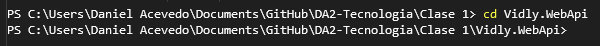

# Kestrel

Como ya se dijo, ASP.NET Core es un framework que es multi plataforma. Soporta tanto desarrollo como ejecución en diferentes sistemas operativos como Windows, Linux o MacOS.

**Kestrel** es un web server multiplataforma y liviano para aplicaciones web ASP.NET Core. Este server soporta todas las plataformas que ASP.NET Core soporta.

**Kestrel** está diseñado para ser rápido, escalable y eficiente que pueda manejar requests http y brindar contenido a clientes. **Kestrel** es el web server por defecto que viene con ASP.NET Core, y puede ser usado por sí solo o en combinación con algún otro web server como Apache, IIS, o Nginx.

Para verificar si se está usando **Kestrel**, procedamos a abrir el navegador y la consola de desarrollo. Luego en la sección de la URL poner la URL en la cual se estará escuchando las requests HTTP y se podrá observar lo siguiente:

  

## Puntos claves y características

- **Multiplataforma**: Es completamente multiplataforma y puede ser ejecutado en Windows, Linux y macOS. Está diseñado para operar indiferentemente en cualquier sistema operativo.

- **Performance**: Está optimizado para ser muy performante y es capaz de manejar grandes números de conexiones en simultaneo de forma eficiente. Es particularmente bien adecuado para servir archivos estáticos y manejar trabajos livianos.

- **Asynchronous I/O**: Fue desarrollado usando patrones de programación asíncrona, permitiendo manejar muchas requests con pocos threads, permitiendo una mejora del uso de recursos y responsabilidades.

- **Self-hosting**: Puede ser un web server independiente sin la necesidad de algún software adicional. Esto hace que la actividad de deploy y ejecución de aplicaciones web ASP.NET Core en diferentes plataformas sea sencilla.

- **Integración con reverse proxies**: Es comúnmente usado con servidores reverse proxy como Ngingx o Apache. Los servidores reverse proxy manejan tareas como la terminación SSL, balanceo de carga, y seguridad, mientras que **Kestrel** se enfoca en la lógica de la aplicación.

- **Soporta HTTPS**: Permite asegurar la aplicación web con encriptación SSL/TLS fácilmente.

Cuando una aplicación web ASP.NET Core es deployada, **Kestrel** es el primer punto de contacto para requests HTTP. Sin embargo, es importante destacar que aún así siendo un servidor web muy poderoso, no cuenta con algunas funcionalidades y optimizaciones que uno puede encontrar en servidores web más potentes como IIS. Aún así, el uso de **Kestrel** en conjunto con un reverse proxy para un ambiente en producción es muy común.

## Ventajas

- **Modular y liviano**: Está diseñado para ser minimalista y modular. Uno solo incluye y paga por los componentes necesarios, reduciendo el overhead y potenciales ataques.

- **Integración con ASP.NET Core**: Está fuertemente integrado con la infraestructura de ASP.NET Core, pudiendo tener una interacción y configuración muy fluida usando métodos de ASP.NET Core.

## Desventajas

- **Limitaciones**: Es un servidor web que no se recomienda ser expuesto directamente a internet, sin un reverse proxy en frente. Aunque **Kestrel** está en constante evolución, no cuenta aún con algunas funcionalidades (filtro de requests) o defensa ante ataques profundos en comparación con otros servidores web que si cuentan con esto.

- **Más inmaduro**: Por más que viene recorriendo un largo trayecto y esta listo para ser usado en ambientes de producción, es un servidor web más nuevo que otros. Esto causa que le falten funcionalidades o pruebas en escenarios reales.

- **Complejidad en producción**: En caso de contar con las necesidades de un reverse proxy, hacer uso de este servidor web, puede introducir un extra de complejidad de configuración y puntos de fallo. Esto es así cuando uno no se está familiarizado en la configuración de reverse proxy.

- **Manejo de memoria**: El gran rendimiento de performance es en parte gracias a la descarga de grandes objetos para reducir la garbage collection. Sin embargo, esto puede aumentar el consumo de memoria en escenarios específicos si no es manejado de forma correcta.

## Conclusión

En resumen, **Kestrel** es un buena opción como servidor web para aplicaciones ASP.NET Core por ser liviano, con alta performance y multiplataforma. Aún así con sus limitaciones, específicamente como ser un servidor web expuesto directamente, ofrece algunas ventajas significativas, particularmente en velocidad y capacidades multiplataforma. Emparejar **Kestrel** con un reverse proxy puede balancear la performance y seguridad en muchos escenarios de tipo producción.
