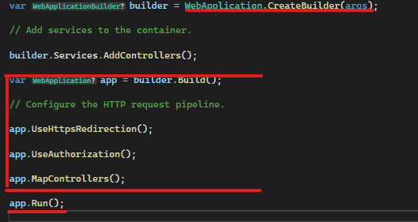

[🔙 Indice](https://github.com/IngSoft-DA2/DA2-Tecnologia/tree/web-api?tab=readme-ov-file#indice) → [🏠 Main](https://github.com/IngSoft-DA2/DA2-Tecnologia/tree/main?tab=readme-ov-file#da2-tecnologia--dise%C3%B1o-de-aplicaciones-2)

# 🏁 Program.cs en ASP.NET Core: El Punto de Entrada de tu Aplicación Web

El archivo `Program.cs` es el **punto de entrada** de toda aplicación ASP.NET Core moderna. Aquí se configura y arranca el *host* de la aplicación web, además de registrarse todos los servicios y middlewares principales.  
¡Todo comienza aquí! 🚦

---

## 🏠 ¿Qué es un Host?

Un **host** es el "envoltorio" que administra el ciclo de vida de la aplicación. Es responsable de:

- 🚦 Iniciar y detener la app.
- ⚙️ Cargar la configuración.
- 🌐 Gestionar el servidor HTTP (ej. Kestrel).
- 🧩 Inyectar dependencias y servicios.

**Tipos de host más comunes:**
- 🌐 **Web Application Host (Minimal Host):** Para aplicaciones web (API/SPA).
- 🧰 **Generic Host:** Para aplicaciones de consola, workers, etc.
- 🏚️ **Web Host:** (obsoleto) Era el modelo anterior a .NET 6.

---

## ✨ Estructura Moderna de Program.cs

Desde .NET 6, la estructura de `Program.cs` es mucho más concisa y minimalista.  
No verás explícitamente el método `Main` en la mayoría de los casos, ya que el SDK lo genera automáticamente.

### 🧠 ¿Cómo funciona internamente esta estructura?

Cuando ejecutas una aplicación ASP.NET Core moderna, el SDK de .NET detecta el archivo `Program.cs` y genera automáticamente el método `Main` detrás de escena.  
Este método se encarga de:

- Inicializar el host (WebApplicationHost).
- Leer la configuración y los argumentos de línea de comando.
- Construir el contenedor de dependencias.
- Levantar el servidor HTTP (usualmente Kestrel).
- Iniciar el ciclo de vida de la aplicación.

Así, la estructura en `Program.cs` queda mucho más limpia y declarativa, permitiéndote centrarte en la configuración y el pipeline, y no en el "boilerplate" clásico.

<p align="center">
  
</p>

---

### 1️⃣ Crear el Builder

```csharp
var builder = WebApplication.CreateBuilder(args);
```

- 🏗️ Crea y configura el host web con opciones por defecto.
- Prepara:
  - 🌐 El servidor HTTP ([Kestrel](https://github.com/daniel18acevedo/DA2-Tecnologia/blob/web-api/kestrel.md))
  - 📝 Logging
  - ⚙️ Configuración (appsettings, environment, etc.)
  - 🧩 Contenedor de servicios (*Dependency Injection*)

Aquí es donde se agregan los servicios con `builder.Services.Add...`.

---

### 2️⃣ Construir la Aplicación

```csharp
var app = builder.Build();
```

- 🔨 Ensambla la aplicación usando la configuración previa.
- Aquí se definen los **middlewares** y el pipeline de la app.

Algunos middlewares habituales:

```csharp
app.UseHttpsRedirection();
```
🔒 Redirecciona automáticamente las solicitudes HTTP a HTTPS para mayor seguridad.

```csharp
app.UseAuthorization();
```
🔑 Verifica que los usuarios tengan los permisos adecuados antes de acceder a recursos protegidos.

```csharp
app.MapControllers();
```
🗺️ Habilita el ruteo de controladores, exponiendo los endpoints definidos en tus clases Controller.

<p align="center">
  
</p>

---

### 3️⃣ Ejecutar la Aplicación

```csharp
app.Run();
```
- 🚀 Inicia la aplicación web y comienza a escuchar solicitudes HTTP en los puertos configurados.

---

## 📌 Resumen de Responsabilidades Clave en Program.cs

- 🖥️ **Configuración del servidor y entorno**
- 🧩 **Registro de servicios y dependencias**
- 🔄 **Definición de middlewares y pipeline de ejecución**
- 🗺️ **Mapeo de endpoints (Controllers, Minimal APIs, etc.)**
- 🚦 **Inicio de la aplicación**

---

> 💡 **Consejo:**  
> Mantén `Program.cs` limpio y organizado, delegando la configuración compleja a métodos de extensión o clases auxiliares.  
> Así tu punto de entrada será siempre claro y mantenible. ✨

---
