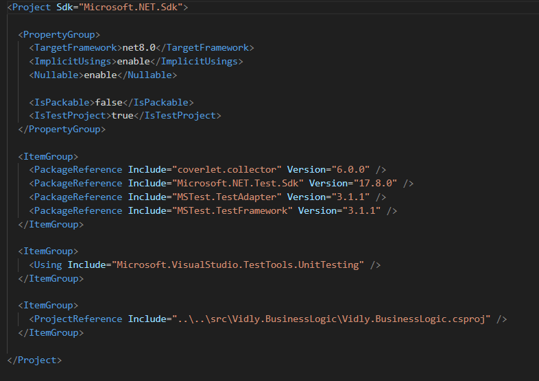

[Indice](https://github.com/IngSoft-DA2/DA2-Tecnologia/tree/web-api?tab=readme-ov-file#indice) -> [Main](https://github.com/IngSoft-DA2/DA2-Tecnologia/tree/main?tab=readme-ov-file#da2-tecnologia--dise%C3%B1o-de-aplicaciones-2)
# Program.cs en ASP.NET Core: El Punto de Entrada de tu Aplicación Web

El archivo `Program.cs` es el **punto de entrada** de toda aplicación ASP.NET Core moderna. Aquí se configura y arranca el *host* de la aplicación web, además de registrarse todos los servicios y middlewares fundamentales para su funcionamiento.

---

## 🏠 ¿Qué es un Host?

Un **host** es el "envoltorio" que administra el ciclo de vida de la aplicación. Es responsable de:

- Iniciar y detener la app.
- Cargar la configuración.
- Gestionar el *servidor HTTP* (ej. Kestrel).
- Inyectar dependencias y servicios.

**Tipos de host más comunes:**
- **Web Application Host (Minimal Host):** Para aplicaciones web (API/SPA).
- **Generic Host:** Para aplicaciones de consola, workers, etc.
- **Web Host:** (obsoleto) Era el modelo anterior a .NET 6.

---

## 📝 Estructura moderna de Program.cs

Desde .NET 6, la estructura de `Program.cs` es mucho más concisa y minimalista. No verás explícitamente el método `Main` en la mayoría de los casos, ya que el SDK lo genera automáticamente. La aplicación sigue tres pasos principales: **crear**, **configurar** y **correr** la web app.

<p align="center">
  
</p>

---

### 1. Crear el builder

```csharp
var builder = WebApplication.CreateBuilder(args);
```

- Crea y configura el host web con opciones por defecto.
- Prepara:
  - El servidor HTTP ([Kestrel](https://github.com/daniel18acevedo/DA2-Tecnologia/blob/web-api/kestrel.md))
  - Logging
  - Configuración (appsettings, environment, etc.)
  - Contenedor de servicios (*Dependency Injection*)

Aquí es donde se agregan los servicios con `builder.Services.Add...`.

---

### 2. Construir la aplicación

```csharp
var app = builder.Build();
```

- Ensambla la aplicación usando la configuración previa.
- Aquí se definen los **middlewares** y el pipeline de la app.

Algunos middlewares habituales:

```csharp
app.UseHttpsRedirection();
```
Redirecciona automáticamente las solicitudes HTTP a HTTPS para mayor seguridad.

```csharp
app.UseAuthorization();
```
Verifica que los usuarios tengan los permisos adecuados antes de acceder a recursos protegidos.

```csharp
app.MapControllers();
```
Habilita el ruteo de controladores, exponiendo los endpoints definidos en tus clases Controller.

<p align="center">
  
</p>

---

### 3. Ejecutar la aplicación

```csharp
app.Run();
```
- Inicia la aplicación web y comienza a escuchar solicitudes HTTP en los puertos configurados.

---

## 🚦 Resumen de responsabilidades clave en Program.cs

- **Configuración del servidor y entorno**
- **Registro de servicios y dependencias**
- **Definición de middlewares y pipeline de ejecución**
- **Mapeo de endpoints (Controllers, Minimal APIs, etc.)**
- **Inicio de la aplicación**

---

> **Consejo:** Mantén `Program.cs` limpio y organizado, delegando la configuración compleja a métodos de extensión o clases auxiliares. Así tu punto de entrada será siempre claro y mantenible.
