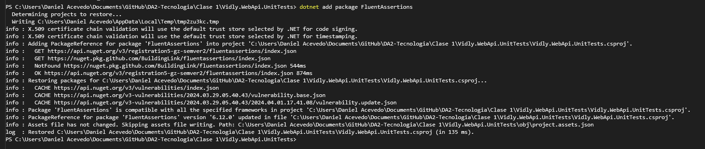
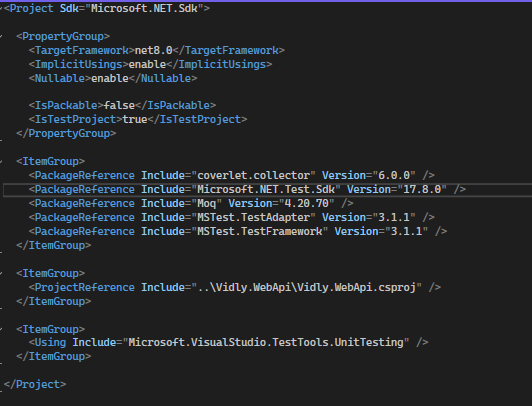
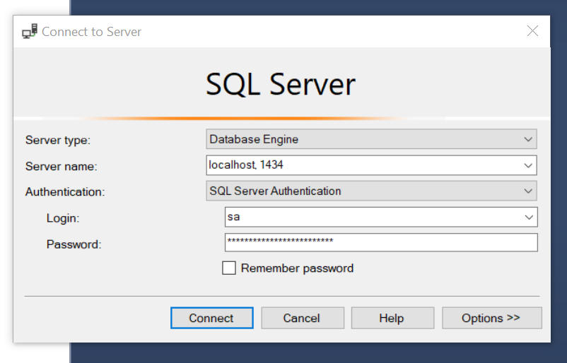
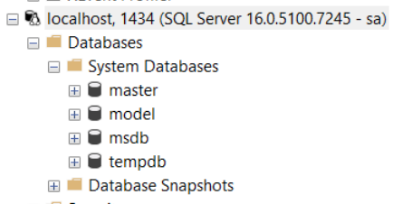
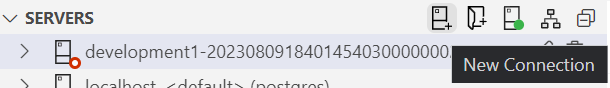
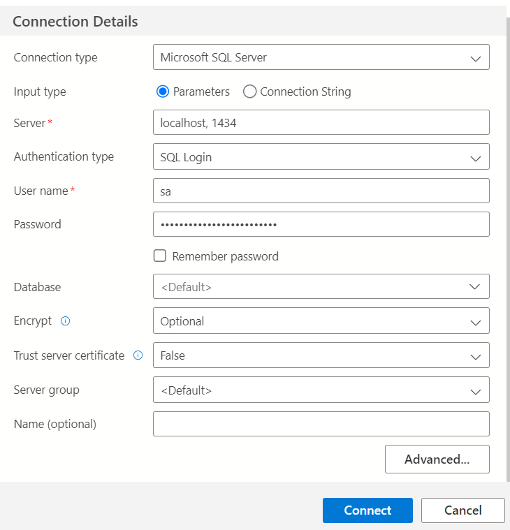
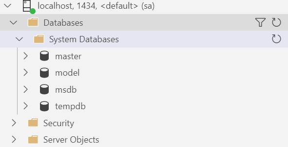

# SQL con Docker 🐳🗄️

Guía práctica para levantar una instancia de SQL Server (Azure SQL Edge) usando Docker. Incluye limpieza de recursos, creación de red opcional, despliegue del contenedor y conexiones desde clientes como SQL Server Management Studio o Azure Data Studio.

---

## 1. Requisitos ✅

- Tener Docker instalado y en ejecución.  
  Descarga: https://www.docker.com/products/docker-desktop  
  Verifica que Docker esté corriendo antes de continuar.

<p align="center">

</p>

---

## 2. Limpieza de recursos no utilizados 🧹

Antes de crear contenedores o redes nuevas, es buena idea limpiar recursos que no se usan para evitar conflictos.

Ejecuta los siguientes comandos en orden:

- Limpiar redes no utilizadas:
```bash
docker network prune
```

- Eliminar todos los contenedores (forzar eliminación):
```bash
docker rm -f $(docker ps -q -a)
```
> ⚠️ Si obtienes un error es normal cuando no hay contenedores; indica que no existe ninguno en ejecución o detenido.

- Limpiar sistema (imágenes, volúmenes o redes no usados):
```bash
docker system prune
```

---

## 3. Crear una red de desarrollo para DA2 (opcional) 🌐

Separar ambientes por redes puede ayudar en entornos locales.

```bash
docker network create dev-da2-network
```

Si no necesitas una red separada, puedes omitir este paso.

---

## 4. Descargar la imagen de SQL Server 📥

Descarga la imagen oficial de Azure SQL Edge:

```bash
docker pull mcr.microsoft.com/azure-sql-edge:latest
```

<p align="center">

</p>

---

## 5. Crear y ejecutar el contenedor ▶️

Crea un contenedor llamado `DEV-SQL` usando la imagen descargada.

Si creaste la red `dev-da2-network`, usa:

```bash
docker run --network dev-da2-network \
  -e "ACCEPT_EULA=1" \
  -e "MSSQL_SA_PASSWORD=MySuperStrongPassword1(!)" \
  -e "MSSQL_PID=Developer" \
  -e "MSSQL_USER=sa" \
  -p 1433:1433 \
  -d --name DEV-SQL \
  mcr.microsoft.com/azure-sql-edge:latest
```

Si NO creaste la red, usa:

```bash
docker run \
  -e "ACCEPT_EULA=1" \
  -e "MSSQL_SA_PASSWORD=MySuperStrongPassword1(!)" \
  -e "MSSQL_PID=Developer" \
  -e "MSSQL_USER=sa" \
  -p 1433:1433 \
  -d --name DEV-SQL \
  mcr.microsoft.com/azure-sql-edge:latest
```

Sustituye según corresponda:
- `MySuperStrongPassword1(!)` → por tu contraseña segura. 🔒  
- `sa` → por otro usuario si lo deseas.

Si ya tienes un servicio usando el puerto `1433`, cambia el mapeo de puertos, por ejemplo `-p 11433:1433`.

Una vez iniciado el comando, verifica que el contenedor esté activo:

<p align="center">

</p>

---

## 6. Conectarse al contenedor 🔌

Usa el cliente que prefieras (SQL Server Management Studio —SSMS—, Azure Data Studio, DBeaver, etc.). Proporciona servidor, usuario y contraseña definidos en el paso anterior.

### SQL Server Management Studio (SSMS)

1. Crear una nueva conexión:
<p align="center">

</p>

2. Completa:
- Server name: `localhost,1433` o `localhost,<puerto>` si cambiaste el puerto  
- Login: `sa` (o usuario elegido)  
- Password: la contraseña que definiste

Conexión establecida:
<p align="center">

</p>

### Azure Data Studio

1. Nueva conexión:
<p align="center">

</p>

2. Rellenar datos (Server, User name, Password):
<p align="center">

</p>

3. Conexión creada:
<p align="center">

</p>

---

## 7. Docker Compose (ejemplo) 🧩

Ejemplo de servicio en `docker-compose.yml` para levantar SQL Server y persistir datos en `./data`:

```yaml
version: "3.8"

services:
  sql-server:
    image: mcr.microsoft.com/azure-sql-edge:latest
    container_name: sql-server
    environment:
      ACCEPT_EULA: "Y"
      MSSQL_SA_PASSWORD: "MySuperStrongPassword1(!)" # Cambia por tu contraseña
      MSSQL_USER: "sa"
      MSSQL_PID: "Developer"
    ports:
      - "1433:1433"
    volumes:
      - ./data:/var/opt/mssql/data
```

Inicia con:
```bash
docker compose up -d
```

---

## 8. Ventajas de Docker Compose y explicación de volúmenes (¿son opcionales?) ✅

Aquí explico por qué usar Docker Compose puede ser mejor que ejecutar solo `docker run`, qué son los volúmenes, tipos y si son obligatorios.

### ¿Qué hace Docker Compose y por qué conviene usarlo? 🚀
- Orquestación simple y declarativa: describe varios contenedores, redes y volúmenes en un solo archivo YAML (docker-compose.yml). En lugar de ejecutar múltiples `docker run`, levantas todo con `docker compose up -d`.
- Reproducibilidad: el YAML documenta versiones de imagen, variables, puertos y volúmenes; facilita que otros repliquen el entorno exacto.
- Dependencias y orden de arranque: `depends_on` controla orden (útil cuando una app necesita que la DB esté arriba).
- Red por proyecto y resolución por nombre: los servicios pueden comunicarse por nombre (por ejemplo, una aplicación se conecta a `sql-server`).
- Escalado y perfiles: puedes escalar servicios para pruebas (`--scale`), y definir overrides para dev/prod.
- Comandos útiles centralizados: `docker compose up/down`, `logs`, `exec`, `ps` hacen la vida más fácil.

Cuándo usar uno u otro:
- `docker run`: rápido, útil para pruebas puntuales o un único contenedor.
- `docker compose`: recomendado cuando trabajas con más de un servicio, necesitas persistencia, redes entre servicios o quieres que el entorno sea reproducible.

### ¿Qué son los volúmenes y por qué importan? 🗄️
- Concepto: un volumen es almacenamiento gestionado por Docker que vive fuera del sistema de archivos efímero del contenedor. Los datos en un volumen sobreviven a la eliminación del contenedor.
- Importancia para bases de datos: sin volumen, los datos se pierden al eliminar el contenedor. Para persistir la DB, necesitas un volumen.
- Tipos de volúmenes:
  - Bind mount (montaje del host): `./data:/var/opt/mssql/data`. Permite ver/editar archivos desde el host —útil en desarrollo— pero puede traer problemas de permisos.
  - Named volume (volumen nombrado): `sql_data:/var/opt/mssql`. Docker gestiona la ubicación física; es más portable y recomendado para datos.
  - tmpfs: almacenamiento en memoria (no persistente), útil solo para datos temporales de alto rendimiento.

### Ejemplos prácticos

- Crear y usar un volumen nombrado con `docker run`:
```bash
docker volume create sql_data
docker run -d --name DEV-SQL \
  -e "ACCEPT_EULA=1" \
  -e "MSSQL_SA_PASSWORD=TuPassSegura!" \
  -p 1433:1433 \
  -v sql_data:/var/opt/mssql \
  mcr.microsoft.com/azure-sql-edge:latest
```

- `docker run` con bind mount (desarrollo):
```bash
docker run -d --name DEV-SQL \
  -e "ACCEPT_EULA=1" \
  -e "MSSQL_SA_PASSWORD=TuPassSegura!" \
  -p 1433:1433 \
  -v "$(pwd)/data":/var/opt/mssql/data \
  mcr.microsoft.com/azure-sql-edge:latest
```

- `docker-compose.yml` con volumen nombrado (recomendado para persistencia):
```yaml
version: "3.8"
services:
  sql-server:
    image: mcr.microsoft.com/azure-sql-edge:latest
    container_name: sql-server
    environment:
      ACCEPT_EULA: "Y"
      MSSQL_SA_PASSWORD: "TuPassSegura!"
      MSSQL_PID: "Developer"
    ports:
      - "1433:1433"
    volumes:
      - sql_data:/var/opt/mssql

volumes:
  sql_data:
```

Comandos útiles con Compose:
- Levantar: `docker compose up -d`
- Bajar (conservar volúmenes): `docker compose down`
- Bajar y eliminar volúmenes: `docker compose down -v`

### ¿Los volúmenes son opcionales?
- Técnicamente sí: puedes ejecutar contenedores sin volúmenes, pero si necesitas persistencia entre reinicios o si vas a recrear contenedores, debes usar volúmenes.
- Teóricamente sí para bases de datos: se puede crear el servidor sin volumenes, si entre reinicios se mantiene la data, no es necesario para la bd, si se pierde info agregarlos. 
- Recomendación:
  - Desarrollo: bind mounts si quieres editar archivos desde el host (cuidado con permisos).
  - Producción/persistencia: named volumes o almacenamiento externo (NFS, discos) + backups regulares.

### Buenas prácticas rápidas
- No subir contraseñas (oficiales) en texto a repositorios públicos. Usa `.env` o secretos.
- Haz backups regulares (dumps SQL) del volumen de la DB.
- Revisa permisos en bind mounts (`chown`/`chmod`).
- Para reset limpio: `docker compose down -v` (elimina volúmenes).
- En CI/CD, versiona el `docker-compose.yml` y documenta variables necesarias.

---

## 9. Consejos y solución de problemas 🛠️

- Ver logs del contenedor:
```bash
docker logs -f DEV-SQL
```

- Ver estado y puertos en uso:
```bash
docker ps
```

- Si la base no arranca, revisa los logs por errores de contraseña o EULA no aceptado. Asegúrate de que `ACCEPT_EULA` esté en `1` o `Y`.

- Permisos de volumen: si usas Linux/Mac y hay problemas con la carpeta `./data`, revisa permisos y propiedad (chown/chmod).

- Si quieres conectarte desde otra máquina en la red, usa la IP del host (no `localhost`) y asegúrate de abrir el puerto en el firewall.

---
