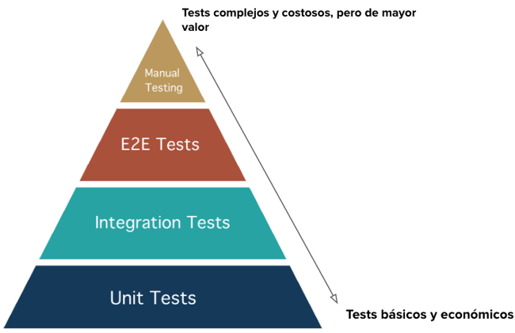

[🔙 Indice](https://github.com/IngSoft-DA2/DA2-Tecnologia/tree/unit-testing?tab=readme-ov-file#indice) → [🏠 Main](https://github.com/IngSoft-DA2/DA2-Tecnologia/tree/main?tab=readme-ov-file#da2-tecnologia--dise%C3%B1o-de-aplicaciones-2)

# 🧪 Pruebas de Software

Las **pruebas** son un pilar fundamental en el desarrollo de software de calidad. Contar con un conjunto adecuado de pruebas asegura que el código desarrollado funcione como se espera y esté libre de errores críticos.  
> _"Test early, test often, test automatically."_ 🚦

---

## 📚 Tipos de Pruebas

  

<em>Pirámide de testing</em>

---

### 🧑‍💻 Pruebas End-To-End (E2E)  

Evalúan el sistema en su totalidad, simulando flujos completos de uso desde la interfaz de usuario hasta la base de datos, replicando la experiencia real del usuario.  
⚠️ Por su complejidad y costo (tiempo y recursos), se emplean principalmente para validar funcionalidades críticas.

---

### 🔗 Pruebas de Integración  

Verifican la interacción entre diferentes **módulos o capas** del sistema, asegurando que funcionen correctamente en conjunto.  
Aunque menos complejas que las E2E, también requieren suficiente configuración y suelen utilizarse para validar puntos de integración específicos.

---

### 🔬 Pruebas Unitarias  

Constituyen la **base de la pirámide de testing**. Se enfocan en probar componentes individuales de forma aislada, validando la correcta funcionalidad de pequeñas unidades de código.  
Permiten a los desarrolladores detectar rápidamente errores localizados y avanzar con seguridad en la evolución del sistema.

**Beneficios de las Pruebas Unitarias:**

- ✅ Garantizan que cada parte del código funcione correctamente por sí sola.
- 🔄 Facilitan el mantenimiento y la refactorización del código.
- 🚀 Aumentan la confianza y velocidad durante el desarrollo.

---

## 🏆 Características de los Test Unitarios según _Clean Code_

En _"Clean Code: A Handbook of Agile Software Craftmanship"_, se establece que los tests unitarios deben cumplir con el principio **FIRST**:

| Letra | Significado   | Descripción                                                                 |
|-------|---------------|-----------------------------------------------------------------------------|
| 🏃‍♂️ **F** | **Fast**        | Deben ejecutarse rápidamente para no interferir con el flujo de trabajo.           |
| 🔗 **I** | **Independent** | El resultado de un test no debe depender de otros.                               |
| ♻️ **R** | **Repeatable**  | Deben arrojar siempre el mismo resultado bajo las mismas condiciones.              |
| ✅ **S** | **Self-Validating** | Deben indicar claramente si pasaron o fallaron, sin requerir validación manual. |
| ⏰ **T** | **Timely**      | Deben ser creados en el momento adecuado, idealmente antes o durante el desarrollo.|

---

### ✨ Otras Características Fundamentales

- 🛡️ **Aislamiento:** Probar componentes sin dependencias externas.
- 🧪 **Diseño basado en casos de prueba:** Cada test se enfoca en un escenario o entrada específica.
- 🎭 **Mocking y Stubbing:** Uso de objetos simulados para reemplazar dependencias externas y controlar el entorno de prueba.
- 🤖 **Integración continua:** Imprescindibles para la automatización en pipelines de integración y entrega continua.
- 🔒 **Seguridad al refactorizar:** Un buen set de pruebas unitarias otorga confianza para realizar cambios en el código.

---

## 🧩 Otros Tipos de Pruebas

- 🏗️ **System Testing:** Evalúa la integridad y funcionalidad del sistema completo contra los requerimientos.
- ✅ **Acceptance Testing:** Valida que el sistema cumple con los criterios de aceptación y está listo para su despliegue.
- 🔄 **Regression Testing:** Garantiza que nuevos cambios no afecten funcionalidades existentes.
- 🚦 **Performance Testing:** Analiza la estabilidad, escalabilidad y uso de recursos bajo diversas cargas.
- 🔐 **Security Testing:** Busca vulnerabilidades y debilidades que puedan ser explotadas.
- 🧑‍🎨 **User Experience (UX) Testing:** Analiza la usabilidad y experiencia general del usuario.

---

## 🎭 Mocks y Test Doubles

Los **mocks** son objetos que simulan el comportamiento de dependencias reales de manera controlada, permitiendo aislar la unidad bajo prueba y validar sus interacciones.  
Son un tipo de **test double** — término que engloba distintas técnicas para reemplazar dependencias durante las pruebas.

### Tipos de Test Doubles

| Tipo   | Descripción |
|--------|-------------|
| 🫙 **Dummy**    | Objetos "de relleno" que cumplen con la firma pero no son utilizados. |
| 🪝 **Stub**     | Proveen respuestas predefinidas a llamadas durante la prueba. |
| 🧸 **Mock**     | Se programan con expectativas sobre las llamadas que recibirán. |
| 🪀 **Fake**     | Implementaciones alternativas simplificadas; útiles cuando la versión real no es práctica (ej. una base de datos en memoria). |
| 🕵️‍♂️ **Spy**      | Registran las interacciones realizadas para su posterior verificación. |

#### ⭐ Ventajas del uso de Test Doubles

- 💡 Permiten aislar la unidad bajo prueba.
- 🕹️ Brindan mayor control sobre el entorno de ejecución.
- ⚡ Aumentan la velocidad de las pruebas.
- 🧩 Otorgan flexibilidad al simular distintos escenarios.

---

## 📖 Lecturas Recomendadas

- [📄 Buenas prácticas para pruebas unitarias - Documentación Microsoft](https://learn.microsoft.com/en-us/dotnet/core/testing/unit-testing-best-practices)
- [📝 Buenas prácticas para pruebas unitarias - Medium](https://medium.com/@kaanfurkanc/unit-testing-best-practices-3a8b0ddd88b5)
